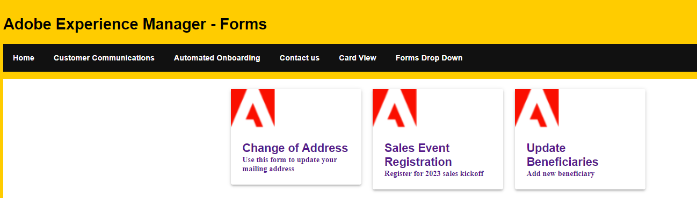

# Fetch and display the forms in card format

Card view format is a design pattern that presents information or data in the form of cards. Each card represents a discrete piece of content or data entry and typically consists of a visually distinct container with specific elements arranged within it. In this article, we will use the [listforms API](https://opensource.adobe.com/aem-forms-af-runtime/api/#tag/List-Forms/operation/listForms) to fetch the forms and display the forms in card format as shown below



## Card Template

The following code was used to design the card template. The card template is displaying the adaptive form's title and description along with Adobe logo. [Material UI components](https://mui.com/) have been used in creating this layout.

``` javascript

import Paper from "@mui/material/Paper";
import Grid from "@mui/material/Grid";
import Container from "@mui/material/Container";
import { Typography } from "@mui/material";
import { Box } from "@mui/system";
const FormCard =({headlessForm}) => {
    return (
              <Grid item xs={3}>
                <Paper elevation={3}>
                    
                    <Box padding={3}>
                    <Typography variant="subtititle2" component="h2">
                        {headlessForm.title}
                    
                    </Typography>
                    <Typography variant="subtititle3" component="h4">
                        {headlessForm.description}
                    
                    </Typography>
                    </Box>
                </Paper>
                </Grid>
          


    );
    

};
export default FormCard;
```

## Fetch the forms

The listforms API was used to fetch the forms from the AEM server. The API returns an array o JSON objects, each JSON object representing a form.

```javascript

import { useState,useEffect } from "react";
import React, { Component } from "react";
import FormCard from "./components/FormCard";
import Grid from "@mui/material/Grid";
import Paper from "@mui/material/Paper";
import Container from "@mui/material/Container";
 
export default function ListForm(){
    const [fetchedForms,SetHeadlessForms] = useState([])
    const getForms=async()=>{
        const response = fetch("/adobe/forms/af/listforms")
        let headlessForms = await (await response).json();
        console.log(headlessForms.items);
        SetHeadlessForms(headlessForms.items);
    }
    useEffect( ()=>{
        getForms()
        

    },[]);
    return(
        <div>
             <div>
                <Container>
                   <Grid container spacing={3}>
                       {
                            fetchedForms.map( (afForm,index) =>
                                <FormCard headlessForm={afForm} key={index}/>
                         
                            )
                        }
                    </Grid>
                </Container>
             </div>

        </div>
    )
}
```

 In the above code, we iterate through the fetchedForms using the map function and for every item in the fetchedForms array a FormCard component is created and added to the Grid container. You can now use the ListForm component in your React app as per your requirements.
