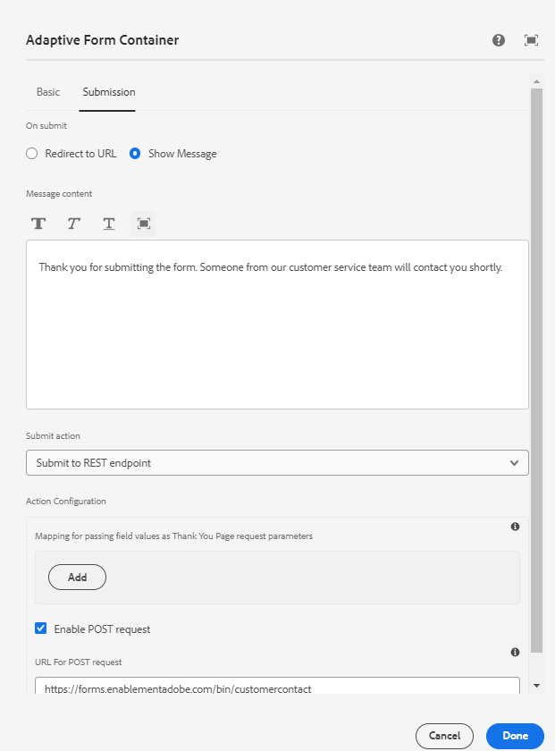

# Display the configured thank you message

A thank you message on form submission is a thoughtful way to acknowledge and express gratitude to the user for completing and submitting a form. It serves as a confirmation that their submission has been received and appreciated. The thank you message is configured using the submission tab of the adaptive form's guide container



The configured thank you message can be accessed in the onSuccess event handler of the AdaptiveForm super component.
The code for associating the onSuccess event,and the code for the onSuccess event handler is listed below

```javascript
<AdaptiveForm mappings={extendMappings} onSubmitSuccess={onSuccess} formJson={selectedForm}/>

```

``` javascript
const onSuccess=(action) =>{
        let body = action.payload?.body;
        debugger;
        setThankYouMessage(body.thankYouMessage.replace(/<(.|\n)*?>/g, ''));
        console.log("Thank you message "+body.thankYouMessage.replace(/<(.|\n)*?>/g, ''));

      }
```

The complete code of the Contact function component is given below

``` javascript
import Form from './components/Form';
import PlainText from './components/plainText';
import TextField from './components/TextField';
import Button from './components/Button';
import { useState,useEffect } from "react";
import { AdaptiveForm } from "@aemforms/af-react-renderer";
export default function Contact(){
  
    const [selectedForm, setForm] = useState("");
    const [thankYouMessage, setThankYouMessage] = useState("");
    const [formSubmitted, setFormSubmitted] = useState(false);
  
    const extendMappings = {
        'plain-text' : PlainText,
        'text-input' : TextField,
        'button' : Button,
        'form': Form
      };
     const onSuccess=(action) =>{
        let body = action.payload?.body;
        debugger;
        setFormSubmitted(true);
        setThankYouMessage(body.thankYouMessage.replace(/<(.|\n)*?>/g, ''));
        // Remove any html tags in the thank you message
        console.log("Thank you message "+body.thankYouMessage.replace(/<(.|\n)*?>/g, ''));

      }
      
      const getForm = async () => {
        
        const resp = await fetch('/adobe/forms/af/L2NvbnRlbnQvZm9ybXMvYWYvY29udGFjdHVz');
        // Get the form id manually using the listform api
        let formJSON = await resp.json();
        setForm(formJSON.afModelDefinition)
      }
      useEffect( ()=>{
        getForm()
        

    },[]);
    
    return(
        
        <div>
           {!formSubmitted ?
            (
                <div>
                    <h1>Get in touch with us!!!!</h1>
                    <AdaptiveForm mappings={extendMappings} onSubmitSuccess={onSuccess} formJson={selectedForm}/>
                </div>
            ) :
            (
                <div>
                    <div>{thankYouMessage}</div>
                </div>
            )}
        </div>
      
          
        
    )
}
```

The above code uses native html components which are mapped to the components used in the adaptive form. For example we are mapping the text-input adaptive form component to TextField component. The native components used in the article [can be downloaded from here](./assets/native-components.zip)
