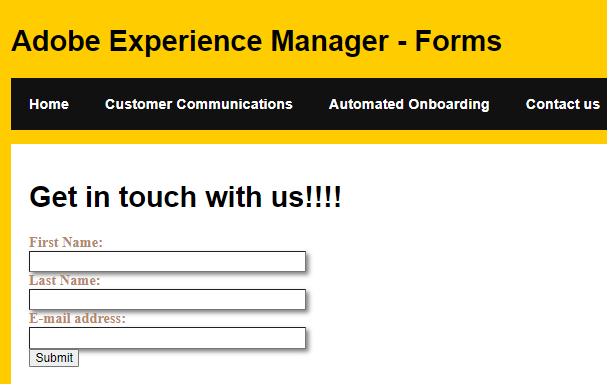

# Embedding Headless Adaptive Form

This [tutorial will cover the various headless APIs](https://opensource.adobe.com/aem-forms-af-runtime/api/#section/Introduction) that allow you to list, display and submit the form.

This article will cover the various headless APIs that are provided to allow you to list, display and submit adaptive forms in a headless manner.
 
This article assumes you have an existing single-page app and would like to list and display the headless adaptive forms in your spa web site.

The following screenshot shows a contact us form being embedded in SPA

## Prerequisites

* React experience

* Running instance of AEM Forms 6.5.16

* [Enable headless forms on your author and publish instance](https://experienceleague.adobe.com/docs/experience-manager-headless-adaptive-forms/using/quick-setup/enable-headless-adaptive-forms-and-core-components.html?lang=en)

## Next Steps

[Install dependencies](./install-af-react-libraries.md)
