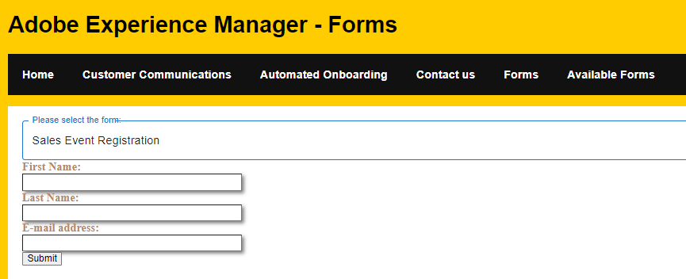

# Select a form to fill from a drop-down list

Dropdown lists provide a compact and organized way to present a list of options to users. The items in the drop down list will be populated with the results of [listforms API](https://opensource.adobe.com/aem-forms-af-runtime/api/#tag/List-Forms/operation/listForms)



## Drop-Down List

The following code was used to populate the drop-down list with the results of the listforms API call. Based on the user selection, the adaptive form is displayed for the user to fill out and submit. [Material UI components](https://mui.com/) have been used in creating this interface

``` javascript
import * as React from 'react';
import Form from './components/Form';
import PlainText from './components/plainText';
import TextField from './components/TextField';
import Button from './components/Button';
import Box from '@mui/material/Box';
import InputLabel from '@mui/material/InputLabel';
import MenuItem from '@mui/material/MenuItem';
import FormControl from '@mui/material/FormControl';
import Select, { SelectChangeEvent } from '@mui/material/Select';
import { AdaptiveForm } from "@aemforms/af-react-renderer";

import { useState,useEffect } from "react";
export default function SelectFormFromDropDownList()
 {
    const extendMappings =
    {
        'plain-text' : PlainText,
        'text-input' : TextField,
        'button' : Button,
        'form': Form
    };

const[formPath, setFormPath] = useState('');
const[afForms,SetOptions] = useState([]);
const [selectedForm, setForm] = useState('');
const HandleChange = (event) =>
     {
        console.log("The path is "+event.target.value) 
    
        setFormPath(event.target.value)
        console.log("The formPath"+ formPath);
     };
const getForm = async () =>
     {
        const resp = await fetch(`${formPath}/jcr:content/guideContainer.model.json`);
        let formJSON = await resp.json();
        console.log(formJSON);
        setForm(formJSON);
     }
const getAFForms =async()=>
     {
        const response = await fetch("/adobe/forms/af/listforms")
        //let myresp = await response.status;
        let myForms = await response.json();
        console.log("Got response"+myForms.items[0].title);
        console.log(myForms.items)
        
        //setFormID('test');
        SetOptions(myForms.items)

        
     }
     useEffect( ()=>{
        getAFForms()
        

    },[]);
    useEffect( ()=>{
        getForm()
        

    },[formPath]);

  return (
    <Box sx={{ minWidth: 120 }}>
      <FormControl fullWidth>
        <InputLabel id="demo-simple-select-label">Please select the form</InputLabel>
        <Select
          labelId="demo-simple-select-label"
          id="demo-simple-select"
          value={formPath}
          label="Please select a form"
          onChange={HandleChange}
          
        >
       {afForms.map((afForm,index) => (
    
        
          <MenuItem  key={index} value={afForm.path}>{afForm.title}</MenuItem>
        ))}
        
       
        </Select>
      </FormControl>
      <div><AdaptiveForm mappings={extendMappings} formJson={selectedForm}/></div>
    </Box>
    

  );
  

}

```

The following two API calls were used in creating this user interface

* [ListForm](https://opensource.adobe.com/aem-forms-af-runtime/api/#tag/List-Forms/operation/listForms). The call to fetch  the forms is made only once when the component is rendered. The results of the API call is stored in the afForms variable.
 In the above code, we iterate through the afForms using the map function and for every item in the afForms array, a MenuItem component is created and added to the Select component.

* Fetch Form - A get call is made to the following endpoint, where the formPath is the path to the selected adaptive form by the user in the drop-down list. The result of this GET call is stored in selectedForm.

```
${formPath}/jcr:content/guideContainer.model.json`
```

* Display the selected form. The following code was used to display the selected form. The AdaptiveForm element is provided in the aemforms/af-react-renderer npm package and it expects the mappings and the formJson as its properties

```
<div><AdaptiveForm mappings={extendMappings} formJson={selectedForm}/></div>
```

## Next Steps

[Display the forms in card layout](./display-forms-card-view.md)


