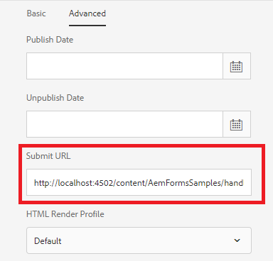

# Handle HTML5 Form Submission

HTML5 forms can be submitted to servlet hosted in AEM. The submitted data can be accessed in the servlet as an input stream. To submit your HTML5 form you need to add "HTTP Submit Button" on your form template using AEM Forms Designer

## Create your submit handler

A simple servlet can be created to handle the HTML5 form submission. The submitted data can then be extracted by using the following code. This [servlet](assets/html5-submit-handler.zip) is made available to you as part of this tutorial. Please install the [servlet](assets/html5-submit-handler.zip) using [package manager](http://localhost:4502/crx/packmgr/index.jsp)

The code from line 9 can be used to invoke J2EE process. Please make sure you have configured [Adobe LiveCycle Client SDK Configuration](https://helpx.adobe.com/aem-forms/6/submit-form-data-livecycle-process.html) if you intend to use the code to invoke J2EE process.

```java
StringBuffer stringBuffer = new StringBuffer();
String line = null;
java.io.InputStreamReader isReader = new java.io.InputStreamReader(request.getInputStream(), "UTF-8");
java.io.BufferedReader reader = new java.io.BufferedReader(isReader);
while ((line = reader.readLine()) != null) {
    stringBuffer.append(line);
}
System.out.println("The submitted form data is " + stringBuffer.toString());
/*
        * java.util.Map params = new java.util.HashMap();
        * params.put("in",stringBuffer.toString());
        * com.adobe.livecycle.dsc.clientsdk.ServiceClientFactoryProvider scfp =
        * sling.getService(com.adobe.livecycle.dsc.clientsdk.
        * ServiceClientFactoryProvider.class);
        * com.adobe.idp.dsc.clientsdk.ServiceClientFactory serviceClientFactory =
        * scfp.getDefaultServiceClientFactory(); com.adobe.idp.dsc.InvocationRequest ir
        * = serviceClientFactory.createInvocationRequest("Test1/NewProcess1", "invoke",
        * params, true);
        * ir.setProperty(com.adobe.livecycle.dsc.clientsdk.InvocationProperties.
        * INVOKER_TYPE,com.adobe.livecycle.dsc.clientsdk.InvocationProperties.
        * INVOKER_TYPE_SYSTEM); com.adobe.idp.dsc.InvocationResponse response1 =
        * serviceClientFactory.getServiceClient().invoke(ir);
        * System.out.println("The response is "+response1.getInvocationId());
        */


```


## Configure the Submit URL of the HTML5 form



* Tap on the xdp and click _Properties_->_Advanced_
* copy http://localhost:4502/content/AemFormsSamples/handlehml5formsubmission.html and paste this in the Submit URL text field
* Click _SaveAndClose_ button.

### Add entry in the Exclude Paths

* Navigate to [configMgr](http://localhost:4502/system/console/configMgr).
* Search for _Adobe Granite CSRF Filter_
* Add the following entry in the Excluded Paths section
* _/content/AemFormsSamples/handlehml5formsubmission_
* Save your changes

### Test the form

* Tap on the xdp template. 
* Click on _Preview_->Preview as HTML
* Enter some data in the form and click submit
* You should see the submitted data written to your server's stdout.log file

### Additional Reading

This [article](https://experienceleague.adobe.com/docs/experience-manager-learn/forms/document-services/generate-pdf-from-mobile-form-submission-article.html) on generating PDF from HTML5 form submission is also recommended.
