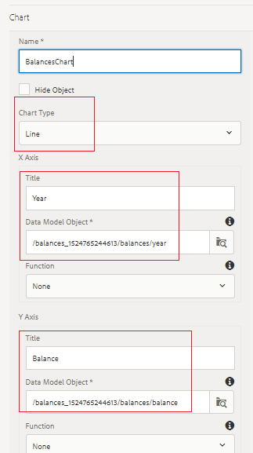
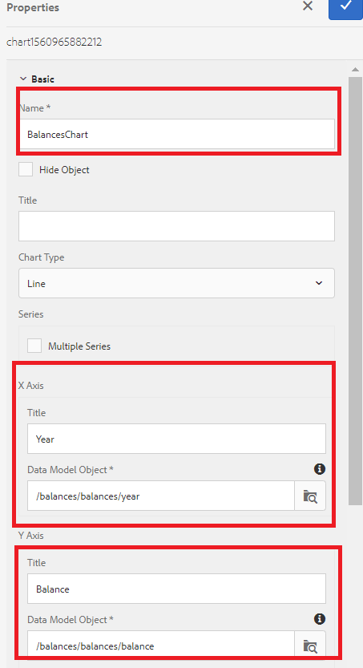

# Configuring line chart for your first interactive communication document

In this part, we will add a Line chart to the account progress panel.

Login to AEM Forms and navigate to Adobe Experience Manager &gt; Forms &gt; Forms & Documents.

Open the 401KStatement folder.

Open the 401KStatement in edit mode.

AEM Forms 6.4 has made it quite simple to display data using various types of charts. We are going to use a Line chart to display balances by year.

Tap on the **Account Progress** target area on the right-hand side and click the "+" icon to bring up the insert component dialog box.

Select Chart to insert the chart component.

Configure the chart component as per the settings in the screenshot below and save your settings by clicking the blue check mark icon.

Please make sure you select the correct form data model element the x and y-axis.

**Line Chart Settings in AEM Forms 6.4**

**Line Chart Settings in AEM Forms 6.5**

## Next Steps

[Configure Table](./partnine.md)
