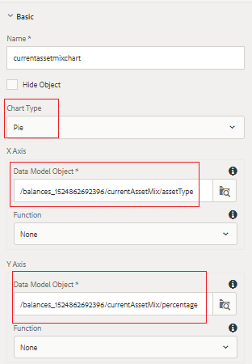
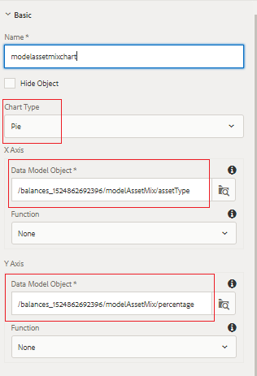

# Configuring Investment Mix Panel

In this part, we will add pie charts to display the current and model investment mix.

* Login to AEM Forms and navigate to Adobe Experience Manager &gt; Forms &gt; Forms & Documents.

* Open the 401KStatement folder.

* Open the 401KStatement in edit mode.

* We will add 2 pie charts to represent the current and model investment mix of the account holder.

## Current Asset Mix {#current-asset-mix}

* Tap on the "CurrentAssetMix" panel on the right-hand side and select the "+" icon and insert text component. Change the default text to "Current Asset Mix".

* Tap on the "CurrentAssetMix" panel and select the "+" icon and insert chart component. Tap on the newly inserted chart component and click on the "wrench" icon to open the configuration properties sheet for the chart.

* Set the properties as shown in the image below. Make sure your chart type is Pie chart.

* Please note the Data Model Object that is bound to the X and Y axes. You need to select the root element of the form data model and then drill down to select the appropriate element.

*  

## Model Asset Mix {#model-asset-mix}

* Tap on the "RecommendedAssetMix" panel on the right-hand side and select the "+" icon and insert text component. Change the default text to "Model Asset Mix".

* Tap on the "RecommendedAssetMix" panel and select the "+" icon and insert chart component. Tap on the newly inserted chart component and click on the "wrench" icon to open the configuration properties sheet for the chart.

* Set the properties as shown in the image below. Make sure your chart type is Pie chart.

* Please note the Data Model Object that is bound to the X and Y axes. You need to select the root element of the form data model and then drill down to select the appropriate element.

* 

