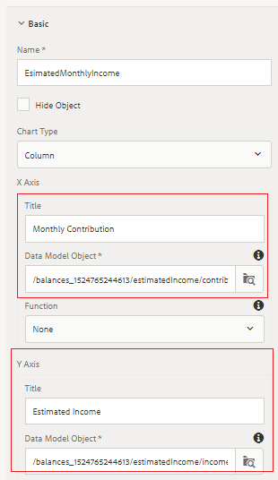
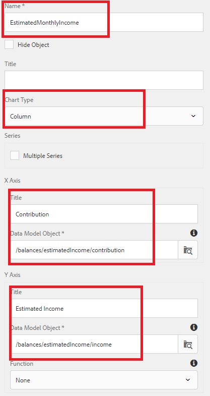

# Configuring Retirement Outlook Panel{#configuring-retirement-outlook-panel}

This is part 10 of a multi-step tutorial for creating your first interactive communications document. In this part, we will configure Retirement Outlook Panel by adding text and chart components.

Login to AEM Forms and navigate to Adobe Experience Manager &gt; Forms &gt; Forms & Documents.

Open the 401KStatement folder.

Open the 401KStatement document in edit mode.

**Configure LeftPanel target area**

Tap on the LeftPanel target area on the right-hand side and click the "+" icon to bring up the insert component dialog box.

Insert Text component.

Gently tap the newly added text component to bring up the component toolbar

Select the "pencil" icon to edit the default text.

Replace the default text with "**Your Retirement Income Outlook"**

**Configure RightPanel target area**

Tap on the RightPanel target area on the right-hand side and click the "+" icon to bring up the insert component dialog box.

Insert Text component.

Gently tap the newly added text component to bring up the component toolbar.

Select the "pencil" icon to edit the default text.

Replace the default text with "**Estimated Monthly Retirement Income"**

## Add Retirement Income Outlook Document Fragment {#add-retirement-income-outlook-document-fragment}

Click on the Assets icon and apply the filter to display assets of type "Document Fragments". Drag and drop RetirementIncomeOutlook document fragment onto the Left Panel target area.

You can refer [to this page](https://helpx.adobe.com/experience-manager/kt/forms/using/interactive-communication-web-channel-aem-forms/9.html) on adding document fragment to content areas.

## Adding Estimated Monthly Income Chart {#adding-estimated-monthly-income-chart}

Click the RightPanel target area on the right-hand side. Click the "+" icon to insert chart component. We will use a column chart to display the estimated monthly income. Gently tap the newly inserted chart component. Select the "Wrench" icon to open the configuration properties sheet.Configure the chart with the following properties as shown in the screenshot below.

**AEM Forms 6.4 - Configuring Estimated Monthly Income Column Chart**

**AEM Forms 6.5 - Configuring Estimated Monthly Income Column Chart**

