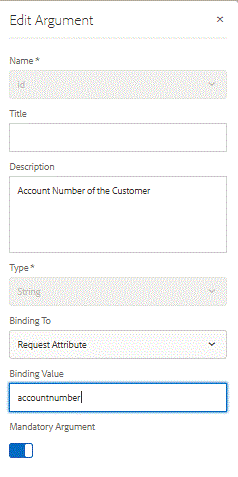

# Setting up the delivery of web channel document {#setting-up-the-delivery-of-web-channel-document}

 In this part, we look at the delivery of web channel document via email.

Once you have defined and tested your web channel interactive communication document, you need a delivery mechanism to deliver the web channel document to the recipient.

To be able to use email as a delivery mechanism for our web channel document, we need to make a minor change to the form data model.

[To learn more about web channel delivery via email](/help/forms/interactive-communications/delivery-of-web-channel-document-tutorial-use.md)

Login to AEM Forms.

* Navigate to Forms -&gt;Data Integrations

* Open the RetirementAccountStatement Data Model in edit mode.

* Select the balances object and click on the edit button.

* Select the "pencil" icon to open the id argument in edit mode.

* Change the binding to "RequestAttribute".

* Set the  accountnumber  in the binding value as shown below.

* This way we are passing in the  accountnumber  through the request attribute to the form data model

* Make sure you save your changes.
 

## Test Email Delivery of Web Channel Document {#test-email-delivery-of-web-channel-document}

* [Install the sample assets using package manager](assets/webchanneldelivery.zip)
* [Login to crx](http://localhost:4502/crx/de/index.jsp#)

* Navigate to /home/users

* Search for admin user  under  the user's node.

* Select the profile node of the admin user.

* Create a property called "accountnumber". Make sure the property type is a string.

* Set the value of this accountnumber property to "3059827". You can set this value to any random number as you wish.

* [Open getad.html](http://localhost:4502/content/getad.html)

* The code associated with this URL will get the accountnumber of the logged in user. This accountnumber is then passed as requestattribute to the FDM. The FDM will then fetch the data associated with this  accountnumber and populate the web channel document.

>[!NOTE]
>
>Please take a look at the **/apps/AEMForms/fetchad/GET.jsp** file in crx. Please make sure the String variable webChannelDocument is pointing to a valid communication document path.

## Next Steps

[Set up E-mail delivery](../interactive-communications/delivery-of-web-channel-document-tutorial-use.md)