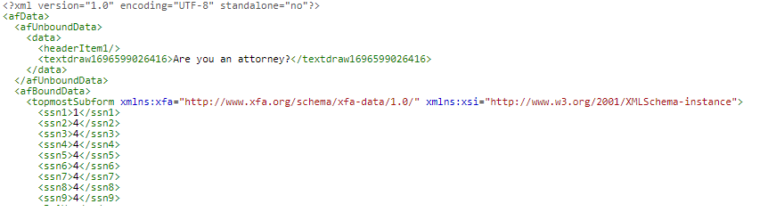

# Introduction

The first step is to create a schema based on the data that will be used to populate the adaptive form. 

## XFA is based on a schema
 
Use the schema to create your adaptive form

## XFA is not based on a schema

* Open the XDP in AEM Forms designer. 
* Click File | Form Properties | Preview.
* Click Generate Preview Data.
* Click Generate.
* Provide a meaningful file name such as `form-data.xml`

You can use any of the free online tools to [generate XSD](https://www.freeformatter.com/xsd-generator.html) from the xml data generated in the previous step.

Create an adaptive form based on the schema from the previous step.

>[!NOTE]
>It is always recommended to examine the data that is generated on the Adaptive Form submission. This will give you a good idea of the XML format of the data that needs to be merged with the adaptive form.

Data submitted from Adaptive form

Data exported from the PDF

Form the exported data, you will have to extract the **_topmostSubform_** node with the appropriate namespaces preserved for successfully merging data with the adaptive form.

## Next Steps

[Create OSGi service](./create-osgi-service.md)
