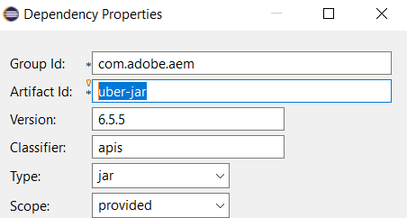
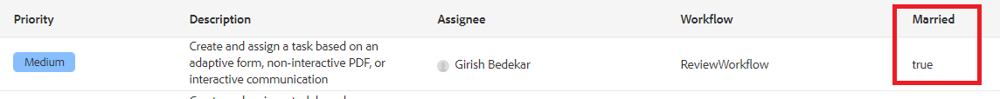

# Add custom columns

To display workflow data in inbox, we need to define and populate variables in the workflow. The value of the variable needs to be set before a task is assigned to a user. To give you a head start we have provided sample workflow that is ready to be deployed on your AEM server.

* [Login to AEM](http://localhost:4502/crx/de/index.jsp)
* [Import the review workflow](assets/review-workflow.zip)
* [Review the workflow](http://localhost:4502/editor.html/conf/global/settings/workflow/models/reviewworkflow.html)

This workflow has two variables defined(isMarried and income) and its values are set using the set variable component. These variables are made available as columns to be added to AEM inbox

## Create service

For every column that we need to display in our inbox we would need to write a service. The following service allows us to add a column to display the value of the isMarried variable

```java
import com.adobe.cq.inbox.ui.column.Column;
import com.adobe.cq.inbox.ui.column.provider.ColumnProvider;

import com.adobe.cq.inbox.ui.InboxItem;
import org.osgi.service.component.annotations.Component;

import java.util.Map;

/**
 * This provider does not require any sightly template to be defined.
 * It is used to display the value of 'ismarried' workflow variable as a column in inbox
 */
@Component(service = ColumnProvider.class, immediate = true)
public class MaritalStatusProvider implements ColumnProvider {@Override
public Column getColumn() {
return new Column("married", "Married", Boolean.class.getName());
}

// Return True or False if 'ismarried' is set. Else returns null
private Boolean isMarried(InboxItem inboxItem) {
Boolean ismarried = null;

Map metaDataMap = inboxItem.getWorkflowMetadata();
if (metaDataMap != null) {
if (metaDataMap.containsKey("isMarried")) {
    ismarried = (Boolean) metaDataMap.get("isMarried");
}
}

return ismarried;
}

@Override
public Object getValue(InboxItem inboxItem) {
return isMarried(inboxItem);
}
}
```

>[!NOTE]
>
>You need to include AEM 6.5.5 Uber.jar in your project for the above code to work



## Test on your server

* [Login to AEM web console](http://localhost:4502/system/console/bundles)
* [Deploy and start inbox customization bundle](assets/inboxcustomization.inboxcustomization.core-1.0-SNAPSHOT.jar)
* [Open your inbox](http://localhost:4502/aem/inbox)
* Open Admin Control by clicking _List View_ icon next to _Create_ button
* Add Married column to Inbox and save your changes
* [Go to FormsAndDocuments UI](http://localhost:4502/aem/forms.html/content/dam/formsanddocuments)
* [Import the sample form](assets/snap-form.zip) by selecting _File Upload_ from _Create_ menu
* [Preview the form](http://localhost:4502/content/dam/formsanddocuments/snapform/jcr:content?wcmmode=disabled)
* Select the _marital status_ and submit the form 
[view inbox](http://localhost:4502/aem/inbox)

Submitting the form will trigger the workflow and a task is assigned to "admin" user. You should see a value under the Married column as shown in this screen shot



## Next Steps

[Display Married Column](./use-sightly-template.md)
