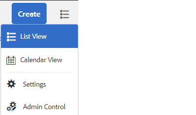
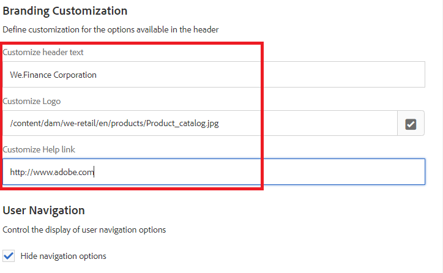

# AEM Inbox

AEM Inbox consolidates notifications and tasks from various AEM components, including Forms workflows. When a forms workflow containing an Assign task step is triggered, the associated application is listed as a task in the assignee's Inbox.

The Inbox user interface provides list and calendar views to view tasks. You can also configure the view settings. You can filter tasks based on various parameters.
 
You can customize an Experience Manager Inbox to change the default title of a column, reorder the position of a column, and display additional columns based on the data of a workflow.

>[!NOTE]
>
>You have to be a member of administrators or workflow-administrators to customize the inbox columns

## Column customization

[Open AEM inbox](http://localhost:4502/aem/inbox)
Open the Admin Control by clicking on the _List View_ icon and then selecting _Admin Control_ as shown in the screen shot below

In the column customization UI you can perform the following operations

* Delete columns
* Re-order the columns
* Rename columns

## Branding Customization

In the branding customization you can do the following

* Add your organization logo
* Customize header text
* Customize the help link
* Hide Navigation options

## Next Steps

[Add Married Column](./add-married-column.md)
