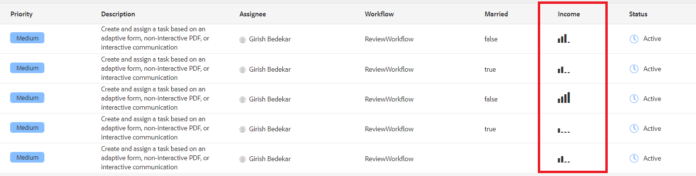

# Using sightly template to display inbox data

You can use sightly template to format the data that is to be displayed in inbox columns. In this example we will display coral-ui icons depending on the value of the income column. The following screenshot shows the use of icons in the income column


[The sightly template](assets/sightly-template.zip) used to display the custom coral ui icons is provided as part of this article.

## Sightly template

Following is the sightly template. The code in the template displays icon depending on the income. The icons are available as part of the [coral ui icon library](https://helpx.adobe.com/experience-manager/6-3/sites/developing/using/reference-materials/coral-ui/coralui3/Coral.Icon.html#availableIcons) that comes with AEM.

```java
<template data-sly-template.incomeTemplate="${@ item}>">
    <td is="coral-table-cell" class="payload-income-cell">
         <div data-sly-test="${(item.workflowMetadata && item.workflowMetadata.income)}" data-sly-set.income ="${item.workflowMetadata.income}">
                 <coral-icon icon="confidenceOne" size="M" data-sly-test="${income >=0 && income <10000}"></coral-icon>
                 <coral-icon icon="confidenceTwo" size="M" data-sly-test="${income >=10000 && income <100000}"></coral-icon>
                 <coral-icon icon="confidenceThree" size="M" data-sly-test="${income >=100000 && income <500000}"></coral-icon>
                 <coral-icon icon="confidenceFour" size="M" data-sly-test="${income >=500000}"></coral-icon>
          </div>
    </td>
</template>


```

## Service implementation

Following code is the service implementation for displaying the income column.

Line 12 associates the column with the sightly template

```java
import java.util.Map;
import org.osgi.service.component.annotations.Component;
import com.adobe.cq.inbox.ui.InboxItem;
import com.adobe.cq.inbox.ui.column.Column;
import com.adobe.cq.inbox.ui.column.provider.ColumnProvider;

@Component(service = ColumnProvider.class, immediate = true)
public class IncomeProvider implements ColumnProvider {
@Override
public Column getColumn() {

return new Column("income", "Income", String.class.getName(),"inbox/customization/column-templates.html", "incomeTemplate");
}

@Override
public Object getValue(InboxItem inboxItem) {
Object val = null;

Map workflowMetadata = inboxItem.getWorkflowMetadata();

if (workflowMetadata != null && workflowMetadata.containsKey("income"))
    val = workflowMetadata.get("income");

return val;
}
}

```

## Test on your server

>[!NOTE]
>
>This article assumes you have installed the [sample workflow](assets/review-workflow.zip) and [sample form](assets/snap-form.zip) from [previous article](https://experienceleague.adobe.com/docs/experience-manager-learn/forms/inbox-customization/add-married-column.html) in this series.

* [Login to crx as admin user](http://localhost:4502/crx/de/index.jsp)
* [import sightly template](assets/sightly-template.zip)
* [Login to AEM web console](http://localhost:4502/system/console/bundles)
* [Deploy and start inbox customization bundle](assets/income-column-customization.jar)
* [Open your inbox](http://localhost:4502/aem/inbox)
* Open Admin Control by clicking on List View next to Create button
* Add income column to Inbox and save your changes
* [Preview the form](http://localhost:4502/content/dam/formsanddocuments/snapform/jcr:content?wcmmode=disabled)
* Select the _marital status_ and submit the form 
* [View inbox](http://localhost:4502/aem/inbox)

Submitting the form will trigger the workflow and a task is assigned to "admin" user. You should see appropriate icon under the income column
