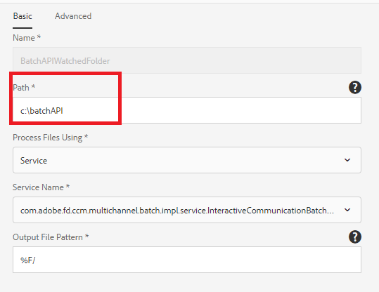
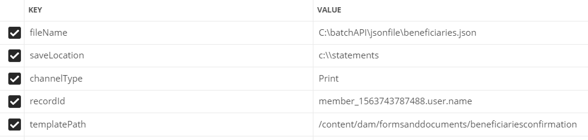

# Batch API

You can use the Batch API to produce multiple interactive communications from a template. The template is an interactive communication without any data. The Batch API combines data with a template to produce an interactive communication. The API is useful in the mass production of interactive communications. For example, telephone bills, credit card statements for multiple customers.

 [Learn more on Batch Generation API](https://experienceleague.adobe.com/docs/experience-manager-65/forms/interactive-communications/generate-multiple-interactive-communication-using-batch-api.html)

 This article provides sample assets to generate Interactive Communications documents using Batch API.

## Batch Generation using Watched Folder

* Import the [Interactive Communication template](assets/Beneficiaries-confirmation.zip) into your AEM Forms server. 
* Import the [watched folder configuration](assets/batch-generation-api.zip). This will create a folder called `batchAPI` in your C drive.

**If you are running AEM Forms on non-windows operating system, please follow the 3 steps mentioned below:**

1. [Open watched folder](http://localhost:4502/libs/fd/core/WatchfolderUI/content/UI.html)
2. Select BatchAPIWatchedFolder and click Edit.
3. Change the Path to match your operating system.

* Download and extract the contents of [zip file](assets/jsonfile.zip). The zip file contains folder named `jsonfile` which contains `beneficiaries.json` file. This file has the data to generate 3 documents.

* Drop the `jsonfile` folder into the input folder of your watched folder. 
* Once the folder is picked up for processing, check the result folder of your watched folder. You should see 3 PDF files generated

## Batch Generation using REST Requests

You can invoke the [Batch API](https://helpx.adobe.com/experience-manager/6-5/forms/javadocs/index.html) through REST requests. You can expose REST endpoints for other applications to invoke the API to generate documents.
The sample assets provided exposes REST endpoint for generating Interactive Communication documents. The servlet accepts the following parameters:

* fileName - Location of the data file on the file system.
* templatePath -  IC template path
* saveLocation - Location to save the generated documents on the file system
* channelType - Print,Web or both
* recordId - JSON path to element to set name of an interactive communication

The following screenshot shows the parameters and its values

## Deploy sample assets on your server

* Import [ICTemplate](assets/ICTemplate.zip) using [package manager](http://localhost:4502/crx/packmgr/index.jsp)
* Import [Custom Submit handler](assets/BatchAPICustomSubmit.zip) using [package manager](http://localhost:4502/crx/packmgr/index.jsp)
* Import [Adaptive Form](assets/BatchGenerationAPIAF.zip) using the [Forms and Document interface](http://localhost:4502/aem/forms.html/content/dam/formsanddocuments)
* Deploy and start [Custom OSGI bundle](assets/batchgenerationapi.batchgenerationapi.core-1.0-SNAPSHOT.jar) using [Felix web console](http://localhost:4502/system/console/bundles)
* [Trigger Batch Generation by submitting the form](http://localhost:4502/content/dam/formsanddocuments/batchgenerationapi/jcr:content?wcmmode=disabled)
