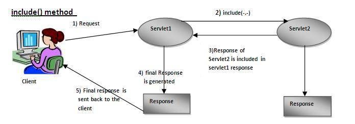
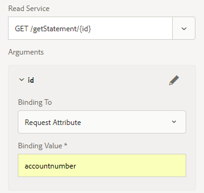

# Email Delivery of Web Channel Document

Once you have defined and tested your web channel interactive communication document, you need a delivery mechanism to deliver the web channel document to the recipient.

In this article, we take a look at email as a delivery mechanism for web channel document. The recipient will get a link to the web channel document via email.On clicking the link, the user will be asked to authenticate and the web channel document will be populated with the data specific to the logged in user.

Let's take a look at the following code snippet. This code is part of GET.jsp which gets triggered when the user click's on the link in the email to view the web channel document. We get the logged in user using the jackrabbit UserManager. Once we get the logged in user, we get the value of the accountNumber property associated with the user's profile.

We then associate the accountNumber  value with a key called  accountnumber  in the map. The key **accountnumber** is defined in the form data modal as a Request Attribute. The value of this attribute is passed as an input parameter to the Form Data Modal read service method.

Line 7: We are sending the received request to another servlet, based on the resource type identified by the Interactive Communication Document url. The response returned by this second servlet is included in the first servlet's response.

```java {.line-numbers}
org.apache.jackrabbit.api.security.user.UserManager um = ((org.apache.jackrabbit.api.JackrabbitSession) session).getUserManager();
org.apache.jackrabbit.api.security.user.Authorizable loggedinUser = um.getAuthorizable(session.getUserID());
String accountNumber = loggedinUser.getProperty("profile/accountNumber")[0].getString();
map.put("accountnumber",accountNumber);
slingRequest.setAttribute("paramMap",map);
CustomParameterRequest wrapperRequest = new CustomParameterRequest(slingRequest,"GET");
wrapperRequest.getRequestDispatcher("/content/forms/af/401kstatement/irastatement/channels/web.html").include(wrapperRequest, response);

```



Visual representation of Line 7 code



Request Attribute defined for read service of the form data modal

Sample Code for Web Channel Delivery

[sample code](assets/webchanneldelivery.zip)
