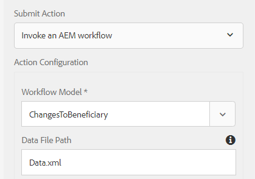

# Generate Print Channel Documents using submitted data

 Print channel documents are typically generated by fetching data from a backend data source through form data model's get service. In some cases, you may have the need to generate print channel documents with the provided data. For example- Customer fills out change of beneficiary form and you may want to generate print channel document with data from the submitted form. To accomplish this use case the following steps need to be followed

## Create prefill service 

The service name "ccm-print-test" will be used to access this service . Once this pre-fill service is defined, you can access this service either in your servlet or workflow process step implementation to generate the print channel document.

```java
import java.io.InputStream;
import org.osgi.service.component.annotations.Component;

import com.adobe.forms.common.service.ContentType;
import com.adobe.forms.common.service.DataOptions;
import com.adobe.forms.common.service.DataProvider;
import com.adobe.forms.common.service.FormsException;
import com.adobe.forms.common.service.PrefillData;

@Component(immediate = true, service = {DataProvider.class})
public class ICPrefillService implements DataProvider {

@Override
public String getServiceDescription() {
    // TODO Auto-generated method stub
    return "Prefill Service for IC Print Channel";
}

@Override
public String getServiceName() {
    // TODO Auto-generated method stub
    return "ccm-print-test";
}

@Override
public PrefillData getPrefillData(DataOptions options) throws FormsException {
    // TODO Auto-generated method stub
        PrefillData data = null;
        if (options != null && options.getExtras() != null && options.getExtras().get("data") != null) {
            InputStream is = (InputStream) options.getExtras().get("data");
            data = new PrefillData(is, options.getContentType() != null ? options.getContentType() : ContentType.JSON);
        }
        return data;
    }
}

```

### Create WorkflowProcess implementation

The workflowProcess implementation code snippet is shown below.This code is executed when process step in the AEM Workflow is associated with this implementation. This implementation expects 3 process arguments which are described below:

* Name of the DataFile path specified when configuring the Adaptive Form
* Name of the print channel template
* Name of the generated print channel document

Line 98 - Since the Adaptive Form is based on Form Data Model, the data residing in the data node of the afBoundData is extracted.
Line 128 - The Data Options service name is set. Note the service name. It has to match with the name returned in Line 45 of the previous code listing.
Line 135 - Document is generated using the render method of the PrintChannel object


```java
String params = arg2.get("PROCESS_ARGS","string").toString();
    String payloadPath = workItem.getWorkflowData().getPayload().toString();
    String dataFile = params.split(",")[0];
    final String icFileName = params.split(",")[1];
    String dataFilePath = payloadPath + "/"+dataFile+"/jcr:content";
    Session session = workflowSession.adaptTo(Session.class);
    Node xmlDataNode = null;
    try {
        xmlDataNode = session.getNode(dataFilePath);
        InputStream xmlDataStream = xmlDataNode.getProperty("jcr:data").getBinary().getStream();
        JsonParser jsonParser = new JsonParser();
        BufferedReader streamReader = null;
        try {
            streamReader = new BufferedReader(new InputStreamReader(xmlDataStream, "UTF-8"));
        } catch (UnsupportedEncodingException e) {
            // TODO Auto-generated catch block
            e.printStackTrace();
        }
        StringBuilder responseStrBuilder = new StringBuilder();
        String inputStr;
        try {
            while ((inputStr = streamReader.readLine()) != null)
                responseStrBuilder.append(inputStr);
        } catch (IOException e) {
            // TODO Auto-generated catch block
            e.printStackTrace();
        }
        String submittedDataXml = responseStrBuilder.toString();
        JsonObject jsonObject = jsonParser.parse(submittedDataXml).getAsJsonObject().get("afData").getAsJsonObject()
                .get("afBoundData").getAsJsonObject().get("data").getAsJsonObject();
        logger.info("Successfully Parsed gson" + jsonObject.toString());
        InputStream targetStream = IOUtils.toInputStream(jsonObject.toString());
        //InputStream targetStream = new ByteArrayInputStream(jsonObject.toString().getBytes());
        
        // Node dataNode = session.getNode(formName);
        logger.info("Got resource using resource resolver"
                );
        resHelper.callWith(getResolver.getFormsServiceResolver(), new Callable<Void>() {
            @Override
            public Void call() throws Exception {
                System.out.println("The target stream is "+targetStream.available());
                // TODO Auto-generated method stub
                com.adobe.fd.ccm.channels.print.api.model.PrintChannel printChannel = null;
                String formName = params.split(",")[2];
                logger.info("The form name I got was "+formName);
                printChannel = printChannelService.getPrintChannel(formName);
                logger.info("Did i get print channel?");
                com.adobe.fd.ccm.channels.print.api.model.PrintChannelRenderOptions options = new com.adobe.fd.ccm.channels.print.api.model.PrintChannelRenderOptions();
                options.setMergeDataOnServer(true);
                options.setRenderInteractive(false);
                com.adobe.forms.common.service.DataOptions dataOptions = new com.adobe.forms.common.service.DataOptions();
                dataOptions.setServiceName(printChannel.getPrefillService());
                // dataOptions.setExtras(map);
                dataOptions.setContentType(ContentType.JSON);
                logger.info("####Set the content type####");
                dataOptions.setFormResource(getResolver.getFormsServiceResolver().getResource(formName));
                dataOptions.setServiceName("ccm-print-test");
                dataOptions.setExtras(new HashMap<String, Object>());
                dataOptions.getExtras().put("data", targetStream);
                options.setDataOptions(dataOptions);
                logger.info("####Set the data options");
                com.adobe.fd.ccm.channels.print.api.model.PrintDocument printDocument = printChannel
                .render(options);
                logger.info("####Generated the document");
                com.adobe.aemfd.docmanager.Document uploadedDocument = new com.adobe.aemfd.docmanager.Document(
                    printDocument.getInputStream());
                logger.info("Generated the document");
                Binary binary = session.getValueFactory().createBinary(printDocument.getInputStream());
                Session jcrSession = workflowSession.adaptTo(Session.class);
                String dataFilePath = workItem.getWorkflowData().getPayload().toString();
                
                Node dataFileNode = jcrSession.getNode(dataFilePath);
                Node icPdf = dataFileNode.addNode(icFileName, "nt:file");
                Node contentNode = icPdf.addNode("jcr:content", "nt:resource");
                contentNode.setProperty("jcr:data", binary);
                jcrSession.save();
                logger.info("Copied the generated document");
                uploadedDocument.close();
                
                return null;
            }

```

To test this on your server, please follow the following steps:

* [Configure the Day CQ Mail Service.](https://helpx.adobe.com/experience-manager/6-5/communities/using/email.html) This is needed to send email with the document generated as an attachment.
* [Deploy the Developing with Service User Bundle](/help/forms/assets/common-osgi-bundles/DevelopingWithServiceUser.jar)
* Make sure you have added the following entry in the Apache Sling Service User Mapper Service Configuration
* **DevelopingWithServiceUser.core:getformsresourceresolver=fd-service**
* [Download and unzip the assets related to this article on to your file system](assets/prefillservice.zip)
* [Import the following packages using the AEM package Manager](http://localhost:4502/crx/packmgr/index.jsp)
    1. beneficiaryconfirmationic.zip
    2. changeofbeneficiaryform.zip
    3. generatebeneficiaryworkflow.zip
* [Deploy the following using AEM Felix Web Console](http://localhost:4502/system/console/bundles)

    * GenerateIC.GenerateIC.core-1.0-SNAPSHOT.jar. This bundle contains the code mentioned in this article. 

* [Open ChangeOfBeneficiaryForm](http://localhost:4502/content/dam/formsanddocuments/changebeneficiary/jcr:content?wcmmode=disabled)
* Make sure the adaptive form is configured to submit to AEM Workflow as shown below

* [Configure the workflow model.](http://localhost:4502/editor.html/conf/global/settings/workflow/models/ChangesToBeneficiary.html)Make sure the process step and send email components are configured as per your environment
* [Preview the ChangeOfBeneficiaryForm.](http://localhost:4502/content/dam/formsanddocuments/changebeneficiary/jcr:content?wcmmode=disabled) Fill in some details and submit
* The workflow should get invoked and IC print channel document should be sent to the recipient specified in the send email component as an attachment
