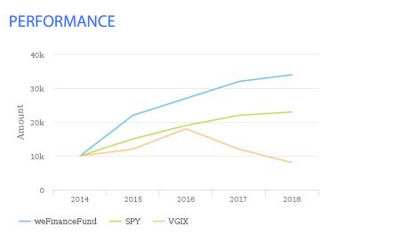
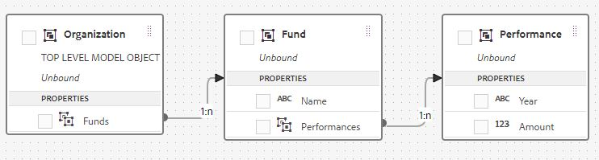

# Multi Series Charts

AEM Forms 6.5 introduced the ability to create and configure multiple series charts. The multiple series charts are typically used in association with Line,Bar,Column chart type. The following chart is an good example of multi series chart. The chart shows the growth of $10,000 USD in 3 different mutual funds over a period of time. To be able to create and use charts of these kind in AEM Forms, you will need to create the appropriate Form Data Model.

To create multi-series charts in AEM Forms, you need to create an appropriate Form Data Model with necessary entities and associations between the entities. The following screenshot highlights the entities and the associations between the 3 entities. At the top level, we have an entity called "Organization", which has a one-to-many association with Fund entity. The Fund entity, in turn, has a one-to-many association with the Performance entity.

## Create Form Data Model for Multi Series Charts

>[!VIDEO](https://video.tv.adobe.com/v/26352?quality=12&learn=on)

### Configure Line Series Charts

>[!VIDEO](https://video.tv.adobe.com/v/26353?quality=12&learn=on)

To test this on your system, please follow the following steps

* [Download and import the MutualFundFactSheet.zip using AEM Package Manager.](assets/mutualfundfactsheet.zip)
* [Download the SeriesChartSampleData.json on to your hard drive.](assets/serieschartsampledata.json) This is the sample data that is used to populate the chart.
* [Navigate to Forms and Documents.](http://localhost:4502/aem/forms.html/content/dam/formsanddocuments)
* Gently select the "MutualFundGrowthFactSheet" interactive communications template.
* Click on Preview | Print Channel | Upload Sample Data.
* Browse to sample data file provided as part of this article.
* Preview the print channel of the "MutualFundGrowthFactSheet" interactive communication with the sample data downloaded in the previous step.
