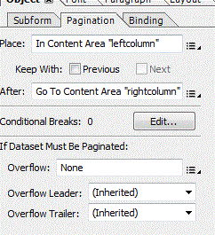
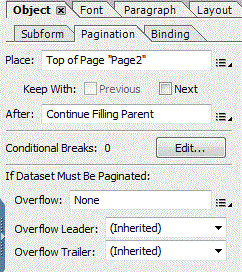

# Two Column Layouts in Print Channel Document

This short article will highlight the steps needed to create 2 column layout in print channel. The use case is to generate 2 page documents with page 1 having 2 column layout and page 2 having the standard 1 column layout.

The following are the high level steps involved in creating 2 column layouts using AEM Forms Designer.

* Create 2 content areas in page 1 master page
* Name the 2 content areas "leftcolumn" and "rightcolumn"
* Create second master page with one content area(this is the default)
* Select the pagination tab (untitled Subform) (page 1) and (untitled Subform) (page2) and set the properties as shown in the screen shots below.

Once the pagination properties are set, we can then add subforms or target areas under (untitled Subform) (Page 1). 

We can then add document fragments to these subforms or target areas. When the left column is full the content will flow to the right column.

To test this on your local server, download the assets related to this article. Scroll down to the bottom of this page

* [Download and install Sample Print Channel Document using package manager](assets/print-channel-with-two-column-layout.zip)
* [Preview the Print Channel Document](http://localhost:4502/content/dam/formsanddocuments/2columnlayout/jcr:content?channel=print&mode=preview&dataRef=service%3A%2F%2FFnDTestData&wcmmode=disabled)
