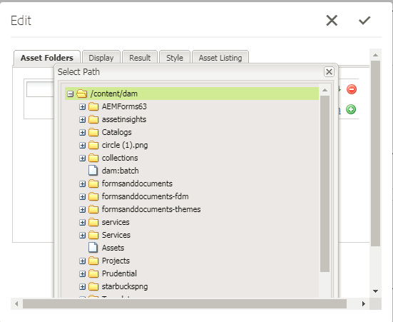
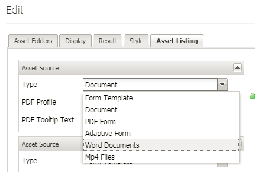

# Registering Custom Asset Types {#registering-custom-asset-types}

Enabling custom asset types for listing in AEMForms Portal

>[!NOTE]
>
>Make sure you have AEM 6.3 with SP1 and the corresponding AEM Forms Add On Installed. This feature only works with AEM Forms 6.3 SP1 and above

## Specify Base Path {#specify-base-path}

The base path is the top level repository path that comprises all the assets that a user may want to list in the search & lister component. If desired, the user may also configure specific locations within the base path from component edit dialog, so that the search is triggered on specific locations rather than searching all the nodes within the base path. By default, the base path is used as the search path criteria for fetching the assets unless the user configures a set of specific paths from within this location. It is important to have an optimal value of this path in order to make a performant search. The default value of base path will remain as **_/content/dam/formsanddocuments_** because all AEM Forms assets reside in **_/content/dam/formsanddocuments._**

Steps to configure the base path

1. Login to crx
1. Navigate to **/libs/fd/fp/extensions/querybuilder/basepath**

1. Click on "Overlay Node" in the toolbar
1. Make sure the overlay location is "/apps/"
1. Click Ok
1. Click Save
1. Navigate to the new structure created at **/apps/fd/fp/extensions/querybuilder/basepath**

1. Change the value of the path property to **"/content/dam"**
1. Click Save

By specifying the path property to **"/content/dam"** you are basically setting Base Path to /content/dam. This can be verified by opening the Search and Lister component.

## Register custom asset types {#register-custom-asset-types}

We have added a new tab(Asset Listing) in the search and lister component. This tab will list out of the box asset types and additional asset types that you configure. By default, the following asset types are listed

1. Adaptive Forms
1. Form Templates
1. PDF Forms
1. Document(Static PDFs)

**Steps to register custom asset type**

1. Create overlay node of **/libs/fd/fp/extensions/querybuilder/assettypes**

1. Set the overlay location to "/apps"
1. Navigate to the new structure created at **/apps/fd/fp/extensions/querybuilder/assettypes  **

1. Under this location, create an 'nt:unstructured' node for the type to be registered, name the node **mp4files. Add the following two properties to this mp4files node**

    1. Add jcr:title property to specify the display name of the asset type. Set the value of jcr:title to "Mp4 Files".
    1. Add "type" property and set its value to "videos". This is the value we use in our template to list assets of the type videos. Save your changes.

1. Create a node of type "nt:unstructured" under mp4files. Name this node "searchcriteria"
1. Add one or more filters under search criteria. Suppose, if the user wants to have a search filter to list mp4Files whose mime type is "video/mp4" you can do so here  
1. Create a node of type "nt:unstructured" under the node searchcriteria. Name this node "filetypes"
1. Add the following 2 properties to this "filetypes" node

    1. name: ./jcr:content/metadata/dc:format
    1. value: video/mp4

1. This means assets having the property dc:format equal to video/mp4 will be considered an asset type "Mp4 Videos". You can use any property listed on the "jcr:content/metadata" node for the search criteria

1. **Make sure to save your work**

After performing the above steps, the new asset type(Mp4 Files) will start showing up in the asset types drop-down list of the Search and Lister component as shown below

[If you have problems in getting this to work, you can import the following package.](assets/assettypeskt1.zip) The package has two custom asset types defined. Mp4 Files and Worddocuments. Suggest you take a look at the **/apps/fd/fp/extensions/querybuilder/assettypes**

[Install the customeportal package](assets/customportalpage.zip). This package contains sample portal page. This page will be used in part2 of this tutorial

