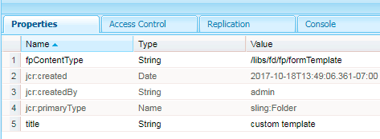
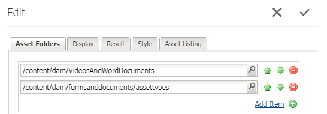
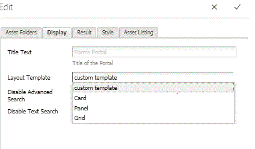
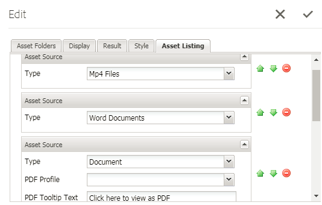
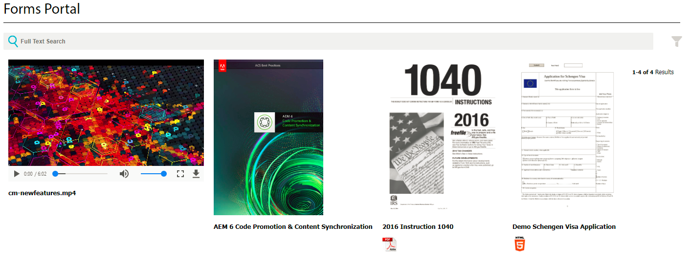

# Listing Custom Asset Types in AEM Forms {#listing-custom-asset-types-in-aem-forms}

## Creating custom template {#creating-custom-template}

For the purpose of this article, we are creating a custom template to display the custom asset types and the OOTB asset types on the same page. To create custom template please follow the following instructions

1. Create a sling: folder  under  /apps. Name it "  myportalcomponent "
1. Add a "fpContentType" property. Set its value to "**/libs/fd/  fp/formTemplate".**  
1. Add a "title" property and set its value to "custom template". This is the name that you will see in the drop-down list of the Search and Lister Component
1. Create a "template.html" under this folder. This file will hold the code to style and display the various asset types.



The following code lists the various types of assets using the search and lister component. We create separate html elements for each type of asset as shown by data-type = "videos" tag. For asset type of "videos" we use the &lt;video&gt; element to play the video inline. For asset type of "worddocuments" we use different html mark up.

```html
<div class="__FP_boxes-container __FP_single-color">
   <div  data-repeatable="true">
     <div class = "__FP_boxes-thumbnail" style="float:left;margin-right:20px;" data-type = "videos">
   <video width="400" controls>
       <source src="${path}" type="video/mp4">
    </video>
         <h3 class="__FP_single-color" title="${name}" tabindex="0">${name}</h3>
     </div>
     <div class="__FP_boxes-thumbnail" style="float:left;margin-right:20px;" data-type = "worddocuments">
       <a href="/assetdetails.html${path}" target="_blank">
           
          </a>
          <h3 class="__FP_single-color" title="${name}" tabindex="0">${name}</h3>
     </div>
  <div class="__FP_boxes-thumbnail" style="float:left;margin-right:20px;" data-type = "xfaForm">
       <a href="/assetdetails.html${path}" target="_blank">
           
          </a>
          <h3 class="__FP_single-color" title="${name}" tabindex="0">${name}</h3>
                <a href="{formUrl}"></a><p>

     </div>
  <div class="__FP_boxes-thumbnail" style="float:left;margin-right:20px;" data-type = "printForm">
       <a href="/assetdetails.html${path}" target="_blank">
           
          </a>
          <h3 class="__FP_single-color" title="${name}" tabindex="0">${name}</h3>
                <a href="{pdfUrl}"></a><p>
     </div>
   </div>
</div>

```

>[!NOTE]
>
>Line 11 - Please change the image src to point to an image of your choice in DAM.
>
>To list Adaptive Forms in this template, create a new div and set its data-type attribute to "guide". You can copy and paste the div whose data-type="printForm and set the newly copied div's data-type to "guide"

## Configure Search And Lister Component {#configure-search-and-lister-component}

Once we have defined the custom template, we now have to associate this custom template with the "Search and Lister" component. Point your browser [to this  url ](http://localhost:4502/editor.html/content/AemForms/CustomPortal.html).

Switch to Design mode and configure the paragraph system to include Search And Lister component in the allowed components group. The Search and Lister component is part of the Document Services group.

Switch to edit mode and add the Search and Lister component to the ParSys.

Open the configuration properties of the "Search and Lister" component. Make sure the "Asset Folders" tab is selected. Select the folders from which you want to list the assets in the search and lister component. For the purpose of this article, I have selected

* /content/dam/VideosAndWordDocuments
* /content/dam/formsanddocuments/assettypes



Tab to the "Display" tab. Here you will choose the template that you want to display the assets in the search and lister component.

Select "custom template" from the drop-down as shown below.



Configure the types of asset's that you want to list in the portal. To configure the types of asset's tab to the "Asset Listing" and configure the types of assets. In this example we have configure the following types of assets

1. MP4 Files
1. Word Documents
1. Document(This is OOTB asset type)
1. Form Template(This is OOTB asset type)

The following screen shot shows you the asset types that are configured for listing



Now that you have configured your Search and Lister Portal Component, it is time to see the lister in action. Point your browser [to this  url ](http://localhost:4502/content/AemForms/CustomPortal.html?wcmmode=disabled). The results should be something like the image shown below.

>[!NOTE]
>
>If your portal is listing custom asset types on a publish server please make sure you give "read" permission to "fd-service" user to the node **/apps/fd/fp/extensions/querybuilder**

 
[Please download and install this package using package manager.](assets/customassettypekt1.zip) This contains sample mp4 and word documents and xdp files that is used as asset types to list using the search and lister component
