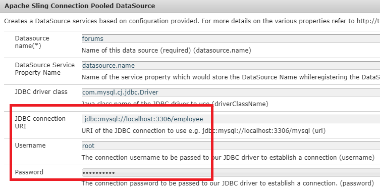
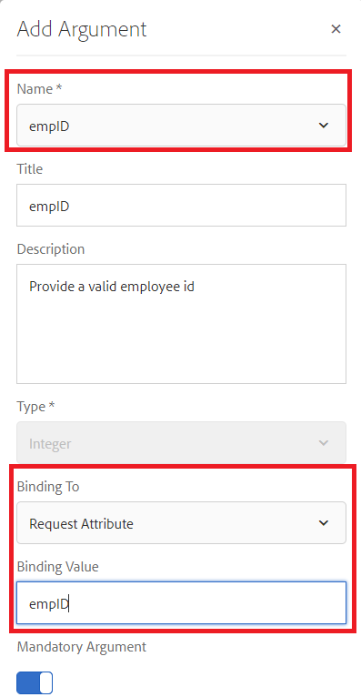
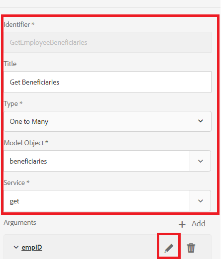
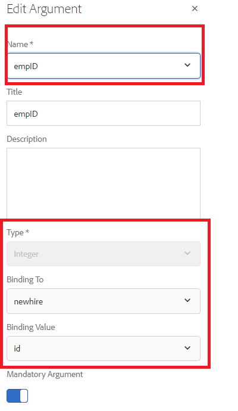
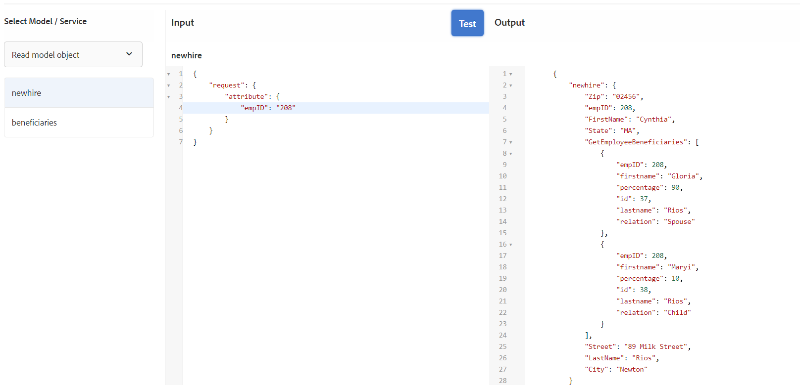

# Configuring form data model

## Apache Sling Connection Pooled DataSource

The first step in creating RDBMS backed form data model is to configure Apache Sling Connection Pooled DataSource. To configure the data source, please follow the steps listed below:

* Point your browser to [configMgr](http://localhost:4502/system/console/configMgr)
* Search for **Apache Sling Connection Pooled DataSource**
* Add a new entry and provide the values as shown in the screenshot.
* 
* Save your changes

>[!NOTE]
>The JDBC Connection URI, Username and Password will change depending on your MySQL database configuration.

## Creating Form Data Model

* Point your browser to [Data Integrations](http://localhost:4502/aem/forms.html/content/dam/formsanddocuments-fdm)
* Click _Create_->_Form Data Model_
* Provide meaningful name and title to form data model such as **Employee**
* Click _Next_
* Select the datasource created in the earlier section(forums)
* Click _Create_->Edit to open the newly created form data model in edit mode
* Expand the _forums_ node to see the employee schema. Expand the employee node to see the 2 tables

## Add entities to your model

* Make sure the employee node is expanded
* Select the newhire and beneficiaries entities and click on _Add Selected_

## Add Read Service to newhire entity

* Select newhire entity
* Click on _Edit Properties_
* Select get from the Read Service drop down list
* Click + icon to add parameter to the get service
* Specify the values as shown in the screenshot
* 
>[!NOTE]
> The get service expects a value mapped to the empID column of newhire entity.There are multiple ways to pass this value and in this tutorial the empID is passed through request parameter called empID.
* Click _Done_ to save the arguments for the get service
* Click _Done_ to save changes to form data model

## Add Association between 2 entities

The associations defined between database entities are not created automatically in the form data model. The associations between entities need to be defined using the form data model editor. Every newhire entity can have one or more beneficiaries, we need to define one-to-many association between the newhire and beneficiaries entities.
The following steps will walk you through the process of creating the one-to-many association

* Select newhire entity and click on _Add Association_
* Provide a meaningful Title and identifier to the association and other properties as shown in the screenshot below
    

* Click on the _edit_ icon under the Arguments section

* Specify values as shown in this screen shot
* 
* **We are linking the two entities using the empID column of beneficiaries and newhire entities.**
* Click on _Done_ to save your changes

## Test your Form Data Model

Our form data model now has **_get_** service which accepts empID and returns the details of the newhire and its beneficiaries. To test the get service, please follow the steps listed below.

* Select newhire entity
* Click on _Test Model Object_
* Provide valid empID and click on _Test_
* You should get results as shown in the screen shot below
* 

## Next Steps

[Get empID from the URL](./get-request-parameter.md)