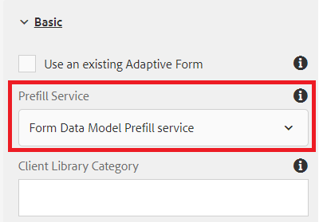
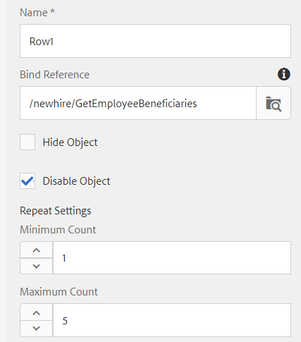

# Create Adaptive Form

So far we have created the following

* Database with 2 tables - `newhire` and `beneficiaries`
* Configured Apache Sling Connection Pooled DataSource 
* RDBMS based Form Data Model

 The next step is to create and configure an Adaptive Form to use form data model.  To get head start you can [download and import](assets/fdm-demo-af.zip) sample form. The sample form has a section to display the employee details and another section to list employee's beneficiaries.
 
## Associate form with form data model

  The sample form provided with this course is not associated with any form data model. To configure the form to use form data model we need to do the following:

* Select the FDMDemo form
* Click on _Properties_->_Form Model_
* Select Form Data Model from the drop down list
* Search and select your Form Data Model created in the earlier lesson.
* Click on _Save & Close_

## Configure Prefill service

The first step is to associate prefill service for the form. To associate prefill service, please follow the steps mentioned below

* Select the `FDMDemo` form
* Click _Edit_ to open the form in edit mode
* Select Form Container in the content hierarchy and click on the wrench icon to open its properties sheet
* Select _Form Data Model Prefill service_ from the Prefill Service drop down list
* Click blue &#9745; to save your changes

* 

## Configure Employee Details

The next step is the bind Adaptive Form's text fields to Form Data Model elements. You will have to open the properties sheet of the following fields and set its bindRef as shown below

| Field Name | Bind Ref           |
|------------|--------------------|
| FirstName  | /newhire/FirstName |
| LastName   | /newhire/lastName  |

>[!NOTE]
>
>Feel free to add additional text fields and bind them to appropriate form data model elements

## Configure Beneficiaries Table

The next step is to display the employee's beneficiaries in tabular fashion. The sample form provided has a table with 4 columns and single row. We need to configure the table to grow depending on the number of beneficiaries.

* Open the form in edit mode.
* Expand Root Panel->Your Beneficiaries->Table
* Select Row1 and click on the wrench icon to open its properties sheet.
* Set the Bind Reference to **/newhire/GetEmployeeBeneficiaries**
* Set the Repeat Settings -  Minimum Count to 1 and Maximum Count to 5. 
* Your Row1 configuration should look like the screen shot below

* Click on the blue &#9745; to save your changes

## Bind Row cells

Finally, we need to bind the Row cells to Form Data Model elements.

* Expand Root Panel->Your Beneficiaries->Table->Row1
* Set the Bind Reference of each row cell as per the table below

| Row Cell   | Bind Reference                               |
|------------|----------------------------------------------|
| First Name | /newhire/GetEmployeeBeneficiaries/firstname  |
| Last Name  | /newhire/GetEmployeeBeneficiaries/lastname   |
| Relation   | /newhire/GetEmployeeBeneficiaries/relation   |
| Percentage | /newhire/GetEmployeeBeneficiaries/percentage |

* Click on the blue &#9745; to save your changes

## Test your form

We now need to open the form with appropriate empID in the url. The following 2 links will populate forms with information from the Database
[Form With empID=207](http://localhost:4502/content/dam/formsanddocuments/fdmdemo/jcr:content?wcmmode=disabled&empID=207)
[Form with empID=208](http://localhost:4502/content/dam/formsanddocuments/fdmdemo/jcr:content?wcmmode=disabled&empID=208)

## Troubleshooting

My form is blank and does not have any data

* Make sure the form data model is returning the correct results.
* Form is associated with the correct Form Data Model
* Check the field bindings
* Check stdout log file. You should see empID being written to the file.If you do not see this value then your form may not be using the custom template that was provided. 

Table is not populated

* Check the Row1 binding
* Make sure the repeat settings for Row1 are set correctly(Min =1 and Max = 5 or more)

