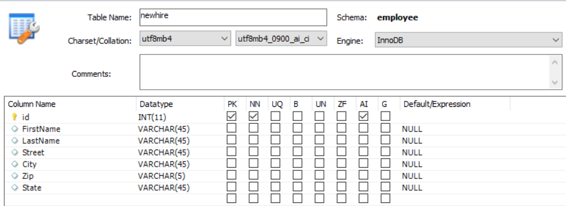
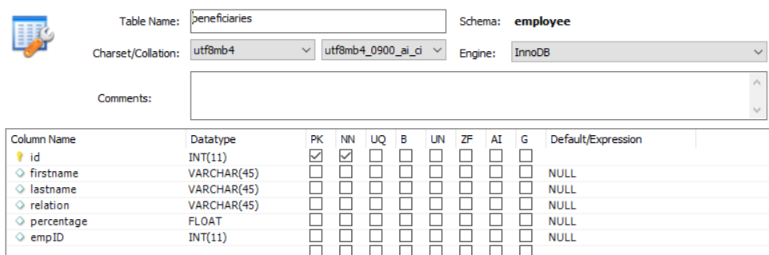

# Create Database Tables

Form data model can be based on RDBMS, RESTfull, SOAP or OData sources. This course's focus is on pre-filing Adaptive Form using form data model backed by RDBMS data source. For the purpose of this tutorial MYSQL database was used. We created the following two tables to demonstrate the use case

* **newhire** table - This table stores the newhire information

  

* **beneficiaries** table - This stores newhire beneficiaries

  

You can import the [sql file](assets/db-schema.sql) using MySQL workbench to create to tables with some sample data.

## Next Steps

[Configure Form Data Model](./configuring-form-data-model.md)
