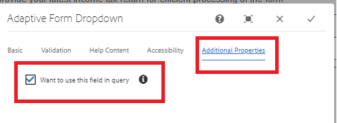
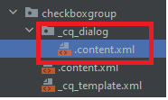

# Make certain fields searchable

Searchable fields in a form typically refer to the fields within the form that can be used as criteria for searching or filterting submitted data.
For the purpose of this use case the following fieldtypes were extended to make them searchable

* checkboxgroup
* dropdown
* radiobutton

 The form authors can mark these field types as searchable as shown below


The fields were extended by creating the following structure



The following is the content of .content.xml file

```xml
<?xml version="1.0" encoding="UTF-8"?>
<jcr:root xmlns:sling="http://sling.apache.org/jcr/sling/1.0" xmlns:cq="http://www.day.com/jcr/cq/1.0" xmlns:jcr="http://www.jcp.org/jcr/1.0" xmlns:nt="http://www.jcp.org/jcr/nt/1.0"
          jcr:primaryType="nt:unstructured"
          jcr:title="Check box group"
          sling:resourceType="cq/gui/components/authoring/dialog">
    <content
            jcr:primaryType="nt:unstructured"
            sling:resourceType="granite/ui/components/coral/foundation/container">
        <items jcr:primaryType="nt:unstructured">
            <tabs
                    jcr:primaryType="nt:unstructured"
                    sling:resourceType="granite/ui/components/coral/foundation/tabs"
                    maximized="{Boolean}false">
                <items jcr:primaryType="nt:unstructured">

                    <properties
                            jcr:primaryType="nt:unstructured"
                            jcr:title="Additional Properties"
                            sling:resourceType="granite/ui/components/coral/foundation/container"
                            margin="{Boolean}true">
                        <items jcr:primaryType="nt:unstructured">
                            <columns
                                    jcr:primaryType="nt:unstructured"
                                    sling:resourceType="granite/ui/components/coral/foundation/fixedcolumns"
                                    margin="{Boolean}true">
                                <items jcr:primaryType="nt:unstructured">
                                    <column
                                            jcr:primaryType="nt:unstructured"
                                            sling:resourceType="granite/ui/components/coral/foundation/container">
                                        <items jcr:primaryType="nt:unstructured">
                                            <Searchable
                                                    jcr:primaryType="nt:unstructured"
                                                    sling:resourceType="granite/ui/components/coral/foundation/form/checkbox"
                                                    emptyText="Want to include in search?"
                                                    fieldDescription="Indicate if you want to use in search"
                                                    text="Want to use this field in query"
                                                    value="{Boolean}true"
                                                    uncheckedValue="{Boolean}false"

                                                    name="./Searchable"
                                                    checked="{Boolean}false"
                                                    required="{Boolean}false"/>


                                        </items>
                                    </column>
                                </items>
                            </columns>
                        </items>
                    </properties>
                </items>
            </tabs>
        </items>
    </content>
</jcr:root>

```

## Next Steps

[Create custom submit handler](./part2.md)
