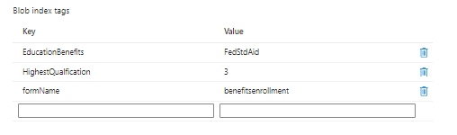

# Create custom submit

A custom submit handler was written to handle the form submission. At a high level the custom submit handler does the following

* Extracts the name of the submitted form.
* Extracts the submitted data.The submitted data of an core component based form is always in JSON format.
* Extracts and stores the form attachments in Azure portal. Updates the submitted json data with the attachment's url.
* Creates blob index tags - Finds the list of searchable field for the form and its corresponding value from the submitted data.
* Associates the blob index tags with the submitted data and stores it in Azure portal.

The following screen shot shows you the blob index tags in Azure portal

The custom submit code is in **_StoreFormDataWithBlobIndexTagsInAzure_** and the code for storing and retrieving data from Azure is in the component **_SaveAndFetchFromAzure_**

## Next Steps

[Build query interface](./part3.md)
