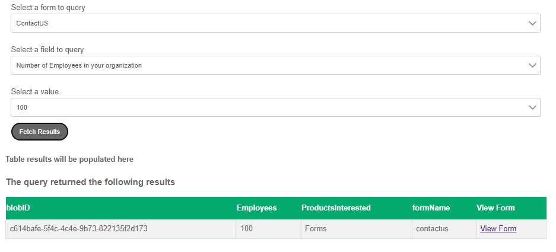

# Build query interface

A simple query interface was built to allow the "Administrator" to input search criteria in order to retrieve specifc form submissions. The results are then displayed in a simple tabular format with the option to view a particular form submission.

The dropdowns in this interface are cascading dropdown. The options available in the dropdown change based on the selections made in the previous dropdown.

The dropdowns are populated using RESTful data sources.

The search results are displayed in a custom component called "SearchResults". When the user clicks the view button the form is prefilled with the submitted data and attachments.

## Next Steps

[Write the prefill service](./part4.md)
