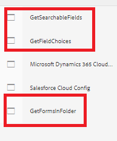

# Deploy the sample on your local server

To get this usecase working on your local server, please follow the steps listed below.It is assumed your AEM instance is running on localhost, 4502 port.

* [Install the package](assets/azuredemo.all-1.0.0-SNAPSHOT.zip) using package manager.

* Provide the Azure portal credentials using the OSGi configMgr

    Make sure the Storage URI ends in slash and the SAS token starts with a ?
* Navigate to [AzureDemo](http://localhost:4502/libs/fd/fdm/gui/components/admin/fdmcloudservice/fdm.html/conf/azuredemo)

* Edit the authentication settings of the following 3 datasources to match your environment

* Preview and submit [ContactUs form](http://localhost:4502/content/dam/formsanddocuments/azureportal/contactus/jcr:content?wcmmode=disabled)

* [Query your form submission](http://localhost:4502/content/dam/formsanddocuments/azureportal/queryformsubmissions/jcr:content?wcmmode=disabled)
