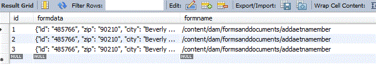

# Create Adaptive Form based on JSON Schema

The ability to create Adaptive Forms based on JSON schema was introduced with AEM Forms 6.3 release. The details on creating Adaptive Forms with JSON schema are explained in detail in this [article](https://helpx.adobe.com/experience-manager/6-3/forms/using/adaptive-form-json-schema-form-model.html).

Once you create Adaptive Form based on JSON schema, the next step is to store the submitted data in database. For this purpose we will use the new JSON data type introduced by various database vendors. For the purpose of this article we will use MySql 8 database to store the submitted data.

MySql 8 database was used for this article. MySQL introduced a new data type called [JSON](https://dev.mysql.com/doc/refman/8.0/en/json.html). This makes it easier to store and query JSON objects. We will be storing the submitted data in a column of type JSON in our database.

The following screen shot shows the submitted form data stored in JSON data type. The column "formdata" is of type JSON. We also stored the name of the form associated with the data in the column formname

>[!NOTE]
>
>Please make sure your json schema file is named appropriately. For example it needs to be named in the following format &lt;name&gt;schema.json. So your schema file can be mortgage.schema.json or credit.schema.json.

[Sample JSON Schemas that can be used to create Adaptive Forms.](assets/samplejsonschemas.zip). Download and unzip the zip file to get the JSON schemas
