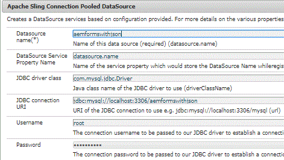

# Storing Submitted Data in Database


>[!NOTE]
>
>It is recommended to use MySQL 8 as your database as it has the support for JSON data type. You will also need to install the appropriate driver for MySQL DB. I have used the driver available in this location https://mvnrepository.com/artifact/mysql/mysql-connector-java/8.0.12

To store the submitted data in database, we will write a servlet to extract the bound data and the form name and store. The complete code to handle the form submission and store the afBoundData in the database is given below.

We created custom submit to handle the form submission. In this custom submit's post.POST.jsp we forward the request to our servlet.

To learn more about custom submit pleas read this [article](https://helpx.adobe.com/experience-manager/kt/forms/using/custom-submit-aem-forms-article.html)

com.adobe.aemds.guide.utils.GuideSubmitUtils.setForwardPath(slingRequest,"/bin/storeafsubmission",null,null);

```java
package com.aemforms.json.core.servlets;

import java.sql.Connection;
import java.sql.PreparedStatement;
import java.sql.SQLException;

import javax.servlet.Servlet;
import javax.servlet.ServletException;
import javax.sql.DataSource;

import org.apache.sling.api.SlingHttpServletRequest;
import org.apache.sling.api.SlingHttpServletResponse;
import org.apache.sling.api.servlets.SlingAllMethodsServlet;
import org.json.JSONException;
import org.json.JSONObject;
import org.osgi.service.component.annotations.Component;
import org.osgi.service.component.annotations.Reference;
import org.slf4j.Logger;
import org.slf4j.LoggerFactory;

@Component(service = Servlet.class, property = {

"sling.servlet.methods=get", "sling.servlet.methods=post",

"sling.servlet.paths=/bin/storeafsubmission"

})
public class HandleAdaptiveFormSubmission extends SlingAllMethodsServlet {
 private static final Logger log = LoggerFactory.getLogger(HandleAdaptiveFormSubmission.class);
 private static final long serialVersionUID = 1L;
 @Reference(target = "(&(objectclass=javax.sql.DataSource)(datasource.name=aemformswithjson))")
 private DataSource dataSource;

 protected void doPost(SlingHttpServletRequest request, SlingHttpServletResponse response) throws ServletException {
  JSONObject afSubmittedData;
  try {
   afSubmittedData = new JSONObject(request.getParameter("jcr:data"));
   // we will only store the data bound to schema
   JSONObject dataToStore = afSubmittedData.getJSONObject("afData").getJSONObject("afBoundData")
     .getJSONObject("data");
   String formName = afSubmittedData.getJSONObject("afData").getJSONObject("afSubmissionInfo")
     .getString("afPath");
   log.debug("The form name is " + formName);
   insertData(dataToStore, formName);

  } catch (JSONException e) {
   // TODO Auto-generated catch block
   e.printStackTrace();
  }

 }

 public void insertData(org.json.JSONObject jsonData, String formName) {
  log.debug("The json object I got to insert was " + jsonData.toString());
  String insertTableSQL = "INSERT INTO aemformswithjson.formsubmissions(formdata,formname) VALUES(?,?)";
  log.debug("The query is " + insertTableSQL);
  Connection c = getConnection();
  PreparedStatement pstmt = null;
  try {
   pstmt = null;
   pstmt = c.prepareStatement(insertTableSQL);
   pstmt.setString(1, jsonData.toString());
   pstmt.setString(2, formName);
   log.debug("Executing the insert statment  " + pstmt.executeUpdate());
   c.commit();
  } catch (SQLException e) {

   log.error("Getting errors", e);
  } finally {
   if (pstmt != null) {
    try {
     pstmt.close();
    } catch (SQLException e) {
     // TODO Auto-generated catch block
     e.printStackTrace();
    }
   }
   if (c != null) {
    try {
     c.close();
    } catch (SQLException e) {
     // TODO Auto-generated catch block
     e.printStackTrace();
    }
   }
  }
 }

 public Connection getConnection() {
  log.debug("Getting Connection ");
  Connection con = null;
  try {

   con = dataSource.getConnection();
   log.debug("got connection");
   return con;
  } catch (Exception e) {
   log.error("not able to get connection ", e);
  }
  return null;
 }

}

```



To get this working your system please follow the following steps

* [Download and unzip the zip file](assets/aemformswithjson.zip)
* Create AdaptiveForm  With JSON Schema. You can use the JSON schema provided as part of this article assets. Make sure you submit action of the form is configured appropriately. Submit action needs to be configured to the "CustomSubmitHelpx".
* Create a schema in your MySQL instance by importing the schema.sql file using the MySQL Workbench tool. The schema.sql file is also provided to you as part of this tutorial assets.
* Configure the Apache Sling Connection Pooled DataSource from the Felix web console
* Make sure you name your datasource name "aemformswithjson". This is the name that is used by the sample OSGi bundle that is provided to you
* Refer to the image above for properties. This is assuming you are going to use MySQL as your Database.
* Deploy the OSGi bundle(s) that are provided as part of this article assets.
* Preview the form and submit.
* The JSON data is stored in the database that was created when you imported "schema.sql" file.
