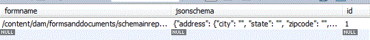

# Storing JSON Schema in Database {#storing-json-schema-in-database}


To be able to query on the submitted data, we will need to store the JSON schema associated with the submitted form. The JSON schema will be used in the query builder to build the query.

When an Adaptive Form is submitted, we check to see if the associated JSON schema is in the database. If the JSON schema does not exist, we fetch the JSON schema and store the schema in the appropriate table. We also associate the form name with the JSON schema. The following screenshot shows you the table where the JSON schemas are stored.

 

```java
public String getJSONSchema(String afPath) {
  // TODO Auto-generated method stub
  afPath = afPath.replaceAll("/content/dam/formsanddocuments/", "/content/forms/af/");
  Resource afResource = getResolver.getServiceResolver().getResource(afPath + "/jcr:content/guideContainer");
  javax.jcr.Node resNode = afResource.adaptTo(Node.class);
  String schemaNode = null;
  try {
   schemaNode = resNode.getProperty("schemaRef").getString();
  } catch (ValueFormatException e) {
   // TODO Auto-generated catch block
   e.printStackTrace();
  } catch (PathNotFoundException e) {
   // TODO Auto-generated catch block
   e.printStackTrace();
  } catch (RepositoryException e) {
   // TODO Auto-generated catch block
   e.printStackTrace();
  }
  if (schemaNode.startsWith("/content/dam")) {
   log.debug("The schema is in the dam");
   afResource = getResolver.getServiceResolver()
     .getResource(schemaNode + "/jcr:content/renditions/original/jcr:content");
   resNode = afResource.adaptTo(Node.class);
   InputStream jsonSchemaStream = null;
   try {
    jsonSchemaStream = resNode.getProperty("jcr:data").getBinary().getStream();
    Charset charset = StandardCharsets.UTF_8;
    String jasonSchemaString = IOUtils.toString(jsonSchemaStream, charset);
    log.debug("The Schema is " + jasonSchemaString);
    return jasonSchemaString;
   } catch (ValueFormatException e) {
    // TODO Auto-generated catch block
    e.printStackTrace();
   } catch (PathNotFoundException e) {
    // TODO Auto-generated catch block
    e.printStackTrace();
   } catch (RepositoryException e) {
    // TODO Auto-generated catch block
    e.printStackTrace();
   } catch (IOException e) {
    // TODO Auto-generated catch block
    e.printStackTrace();
   }
  }
  if (schemaNode.startsWith("/assets")) {
   afResource = getResolver.getServiceResolver()
     .getResource(afPath + "/jcr:content/guideContainer/" + schemaNode + "/jcr:content");
   resNode = afResource.adaptTo(Node.class);
   InputStream jsonSchemaStream = null;
   try {
    jsonSchemaStream = resNode.getProperty("jcr:data").getBinary().getStream();
    Charset charset = StandardCharsets.UTF_8;
    String jasonSchemaString = IOUtils.toString(jsonSchemaStream, charset);
    log.debug("The Schema is " + jasonSchemaString);
    return jasonSchemaString;
   } catch (ValueFormatException e) {
    // TODO Auto-generated catch block
    e.printStackTrace();
   } catch (PathNotFoundException e) {
    // TODO Auto-generated catch block
    e.printStackTrace();
   } catch (RepositoryException e) {
    // TODO Auto-generated catch block
    e.printStackTrace();
   } catch (IOException e) {
    // TODO Auto-generated catch block
    e.printStackTrace();
   }
  }

  return null;

 }

```

>[!NOTE]
>
>When creating an Adaptive Form you can either use JSON Schema which is in the repository or upload a JSON schema. The above code will work for both the cases.

The fetched schema is stored in the database using the standard JDBC operations. The following code inserts the schema in the database

```java
public void insertJsonSchema(JSONObject jsonSchema, String afForm) {
  log.debug("$$$$ in insert Schema" + afForm);
  log.debug("$$$$$ The jsonSchema is  " + jsonSchema);
  Connection con = getConnection();
  log.debug("$$$$ got connection is insertJsonSchema");
  String insertTableSQL = "INSERT INTO leads.jsonschemas(jsonschema,formname) VALUES(?,?)";
  PreparedStatement pstmt = null;
  try {

   // org.json.JSONObject jsonSchemaObj = new
   // org.json.JSONObject(jsonSchema);
   pstmt = con.prepareStatement(insertTableSQL);
   pstmt.setString(1, jsonSchema.toString());
   pstmt.setString(2, afForm);
   log.debug("Executing the insert  json schema statment  " + pstmt.executeUpdate());
   con.commit();
  } catch (SQLException e) {
   // TODO Auto-generated catch block
   e.printStackTrace();
  } finally {
   if (con != null) {
    try {
     con.close();
    } catch (SQLException e) {
     // TODO Auto-generated catch block
     e.printStackTrace();
    }
   }
  }

 }

```

To summarize we have done the following so far

* Create Adaptive Form based on JSON schema
* If the form is being submitted the first time we store the JSON schema associated with the form in the database. 
* We store the bound data of the Adaptive Form in the database.

The next steps would be to use QueryBuilder to display the fields to search based on the JSON Schema


