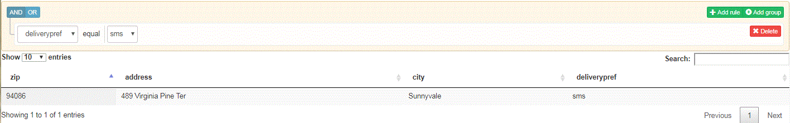

# Querying Submitted Data


The next step is to query the submitted data and display the results in tabular fashion. To accomplish this we will be using the following software

[QueryBuilder](https://querybuilder.js.org/) - UI component to create queries

[Data Tables](https://datatables.net/)- To display the query results in tabular fashion.

The following UI was built to enable querying the submitted data. Only the elements marked as required in the JSON schema are made available to query against. In the screenshot below, we are querying for all submissions where the deliverypref is SMS.

The sample UI to query the submitted data does not use all the advanced capabilities available in QueryBuilder. You are encouraged to try them on your own.



>[!NOTE]
>
>The current version of this tutorial does not support querying multiple columns.

When you select a form to perform your query a GET call is made to **/bin/getdatakeysfromschema**. This GET call returns the required fields associated with the forms' schema. The required fields are then populated in the QueryBuilder's drop-down list for you to build the query.

The following code snippet makes a call to the getRequiredColumnsFromSchema method of JSONSchemaOperations service. We pass the properties and required elements of the schema to this method call. The array that is returned by this function call is then used to populate the query builder drop-down list

```java
public JSONArray getData(String formName) throws SQLException, IOException {

  org.json.JSONArray arrayOfDataKeys = new org.json.JSONArray();
  JSONObject jsonSchema = jsonSchemaOperations.getJSONSchemaFromDataBase(formName);
  Map<String, String> refKeys = new HashMap<String, String>();

  try {
   JSONObject properties = jsonSchema.getJSONObject("properties");
   JSONArray requiredFields = jsonSchema.has("required") ? jsonSchema.getJSONArray("required") : null;
   jsonSchemaOperations.getRequiredColumnsFromSchema(properties, arrayOfDataKeys, "", jsonSchema, refKeys,
     requiredFields);
  } catch (JSONException e) {
   // TODO Auto-generated catch block
   e.printStackTrace();
  }
  return arrayOfDataKeys;

 }
```

When GetResult button is clicked a Get call is made to **"/bin/querydata"**. We pass the query built by QueryBuilder UI to the servlet through the query parameter. The servlet then massages this query into SQL query that can be used to query the database. For example, if you are searching to retrieve all products named 'Mouse' the Query Builder query string will be $.productname = 'Mouse'. This query will then be converted into the following

SELECT &#42; from  aemformswithjson .  formsubmissions  where JSON_EXTRACT(  formsubmissions .formdata,"$.productName ")= 'Mouse'

The result of this query is then returned to populate the table in the UI.

To get this sample running on your local system please perform the following steps

1. [Make sure you have followed all the steps mentioned here](part2.md) 
1. [Import the Dashboardv2.zip using AEM Package Manager.](assets/dashboardv2.zip) This package contains all the necessary bundles,configuration settings, custom submit and sample page to query data.
1. Create a Adaptive Form using the sample json schema
1. Configure the Adaptive Form to submit to "customsubmithelpx" custom submit action
1. Fill out the form and submit
1. Point your browser to [dashboard.html](http://localhost:4502/content/AemForms/dashboard.html)
1. Select the form and perform simple query
