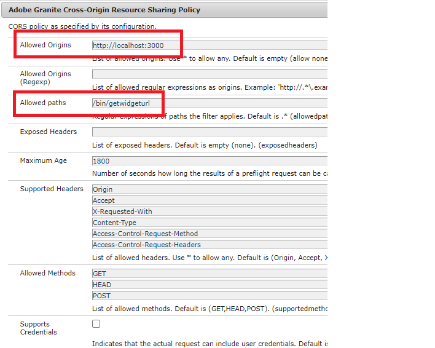

# Deploy the assets

The following assets/configurations were deployed on a AEM Forms publish server.

* [Adobe Sign Wrapper Bundle](assets/AcrobatSign.core-1.0.0-SNAPSHOT.jar)

* [Sample Interactive Communication Template](assets/waiver-interactive-communication.zip)
* [Deploy the DevelopingWithServiceUser bundle](https://experienceleague.adobe.com/docs/experience-manager-learn/assets/developingwithserviceuser.zip)
* Add the following entry in the Apache Sling Service User Mapper Service using the OSGi configMgr 
**DevelopingWithServiceUser.core:getformsresourceresolver=fd-service**
* [Sample React App code can be downloaded from here](assets/src.zip)


The sample react app needs to be deployed on your local environment

You will have to change the endpoint URL to match your environment. Open the EmergencyContact.js file and change the URL in the fetch method

```javascript
 const getWebForm=async()=>
     {
        setSpinner(true)
        console.log("inside widgetURL function emergency contact");
        // NOTE: replace the `aemforms.azure.com:4503` with your AEM FORM server
        let res = await fetch("http://aemforms.azure.com:4503/bin/getwidgeturl",
          {
            method: "POST",
            body: JSON.stringify({"icTemplate":"/content/forms/af/waiver/waiver/channels/print","waiver":formData})
                     
         })
 
```

To enable making POST calls to the AEM endpoint from your REACT app, you will need to specify the appropriate entires in the Allowed Origins field in Adobe Granite Cross-Origin Resource Sharing Policy configuration




