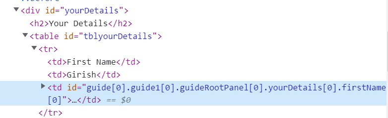

# Create component to summrize the form data

A simple component was created to list the form data for review. The [guidebridge API's visit function](https://developer.adobe.com/experience-manager/reference-materials/6-5/forms/javascript-api/GuideBridge.html?q=visit) was used to iterate through the form fields. The code in the clientlibrary associated with this component get's the panel/table components on the form. From the child elements of this panel/table components form fields title,value and the SOM expression are extracted using the GuidBridge API methods. A simple HTML table is then constructed with the title,value and SOM expression for the end user to review/edit the form data prior to submitting the form.

For example the screen shot below shows you the table created to list the fields and its values of the **YourDetails**. The last TD in the TR is used to edit the field's value using the fields SOM expression.

## Next Steps

[Test the solution on your local system](./deploy-on-your-system.md)
