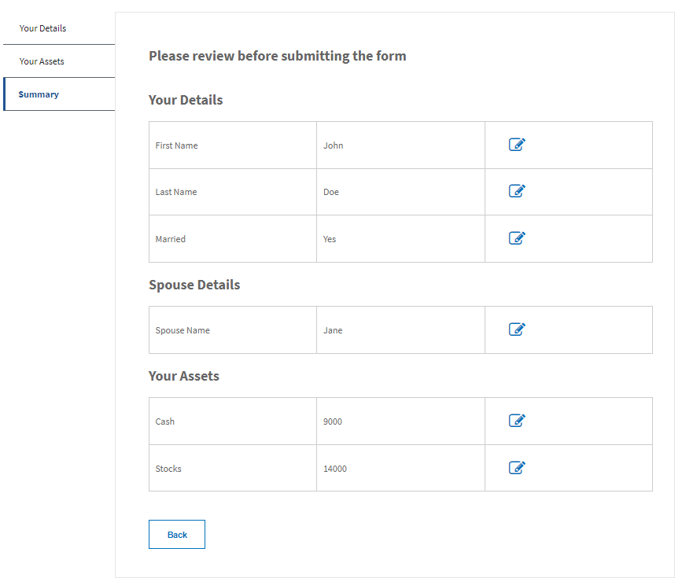

# Review form data before submission

Multi-part tutorial to walk you through the steps involved in creating a summary component for reviewing and editing form data before submitting the form.

To follow this tutorial it is recommended that you have the following installed:

* AEM 6.5 or above with appropriate forms addon package

It is also recommended that you have some level of developer experience with AEM and AEM Forms.

## Next Steps

[Summarize data using custom component](./create-component.md)