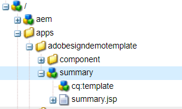
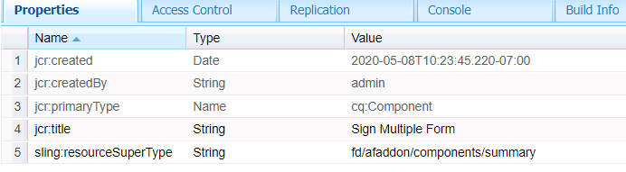
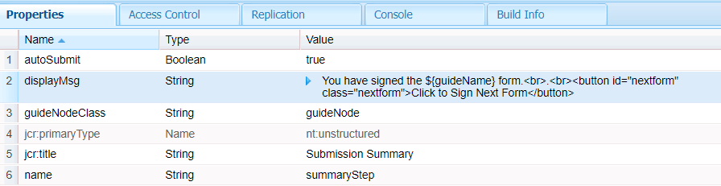

# Customize summary step

Summary step component is used to display the summary of your form submission with a link to download the signed form. Summary step is typically placed in the last panel of your form. 
For the purpose of this use case we have created a new component based on the out of the box Summary component and extended the capability to include custom clientlib.

This component is identified by the label Sign Multiple Form

The following screen shot shows the new component that was created to display the message on completion of the signing ceremony



The new component is based on the out of the box summary component.


We have added a button to navigate to the next form for signing


The summary.jsp has the following code. It has reference to the client library identified by the category id **getnextform** 

```java
<%--
  Guide Summary Component
--%>
<%@include file="/libs/fd/af/components/guidesglobal.jsp"%>
<%@include file="/libs/fd/afaddon/components/summary/summary.jsp"%>
<ui:includeClientLib categories="getnextform"/>

```

## Assets

The custom summary component can be [downloaded from here](assets/custom-summary-step.zip)


