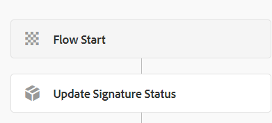

# Update signature status

The UpdateSignatureStatus workflow gets triggered when the user has completed the signing ceremony. The following is the flow of the workflow



Update Signature Status is custom process step.
The main reason for implementing custom process step is to extend an AEM Workflow. The following is the custom code used to update the signature status. 
Code in this custom process step references the SignMultipleForms service.


```java
@Component(property = {
  Constants.SERVICE_DESCRIPTION + "=Update Signature Status in DB",
  Constants.SERVICE_VENDOR + "=Adobe Systems",
  "process.label" + "=Update Signature Status in DB"
})

public class UpdateSignatureStatusWorkflowStep implements WorkflowProcess {
  private static final Logger log = LoggerFactory.getLogger(UpdateSignatureStatusWorkflowStep.class);@Reference
  SignMultipleForms signMultipleForms;@Override
  public void execute(WorkItem workItem, WorkflowSession workflowSession, MetaDataMap args) throws WorkflowException {
    String payloadPath = workItem.getWorkflowData().getPayload().toString();
    String dataFilePath = payloadPath + "/Data.xml/jcr:content";
    Session session = workflowSession.adaptTo(Session.class);
    DocumentBuilderFactory factory = null;
    DocumentBuilder builder = null;
    Document xmlDocument = null;
    Node xmlDataNode = null;
    try {
      xmlDataNode = session.getNode(dataFilePath);
      InputStream xmlDataStream = xmlDataNode.getProperty("jcr:data").getBinary().getStream();
      factory = DocumentBuilderFactory.newInstance();
      builder = factory.newDocumentBuilder();
      xmlDocument = builder.parse(xmlDataStream);
      XPath xPath = javax.xml.xpath.XPathFactory.newInstance().newXPath();
      org.w3c.dom.Node node = (org.w3c.dom.Node) xPath.compile("/afData/afUnboundData/data/guid").evaluate(xmlDocument, javax.xml.xpath.XPathConstants.NODE);
      String guid = node.getTextContent();
      StringWriter writer = new StringWriter();
      IOUtils.copy(xmlDataStream, writer, StandardCharsets.UTF_8);
      System.out.println("After ioutils copy" + writer.toString());
      signMultipleForms.updateSignatureStatus(writer.toString(), guid);
    }
    catch(Exception e) {
      log.debug(e.getMessage());
    }

  }

}
```

## Assets

The update signature status workflow can be [downloaded from here](assets/update-signature-status-workflow.zip)

## Next Steps

[Customize summary step to display the next form for signing](./customize-summary-component.md)
