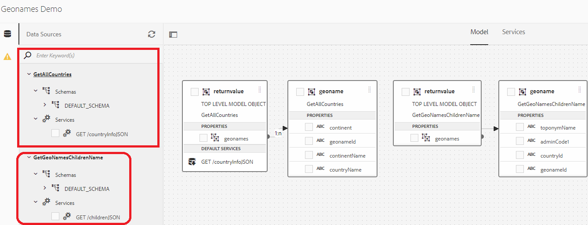
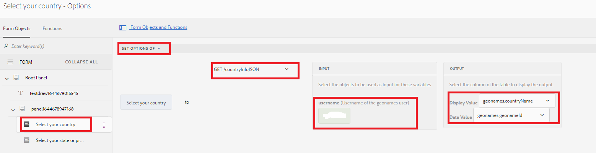
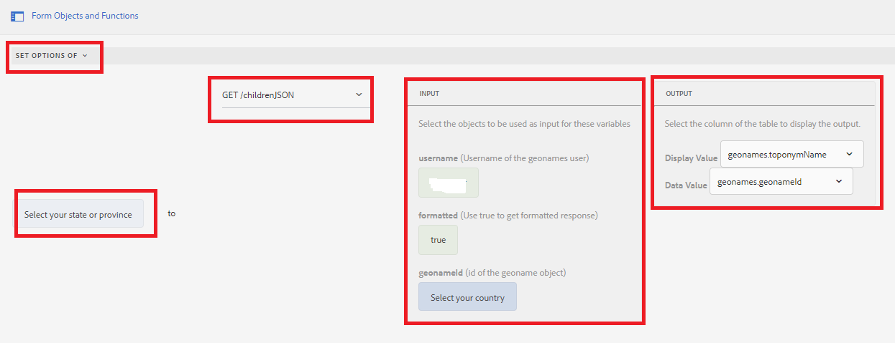
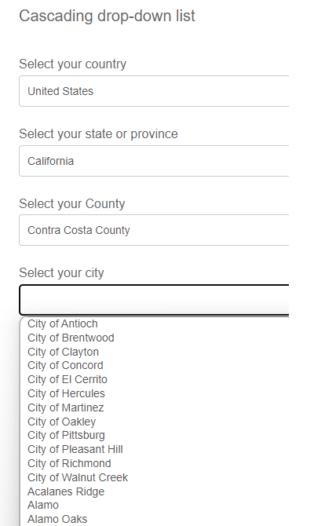

# Cascading drop down lists

A cascading drop-down list is a series of dependent DropDownList controls in which one DropDownList control depends on the parent or previous DropDownList controls. The items in the DropDownList control are populated based on an item that is selected by the user from another DropDownList control.

## Demonstration of the use case

>[!VIDEO](https://video.tv.adobe.com/v/340344?quality=12&learn=on)

For the purpose of this tutorial, I have used [Geonames REST API](http://api.geonames.org/) to demonstrate this capability.
There are a number of organizations providing this kind of service and as long as they have well documented REST API's you can easily integrate with AEM Forms using the data integration capability

The following steps were followed to implement cascading drop down lists in AEM Forms

## Create developer account

Create a developer account with [Geonames](https://www.geonames.org/login). Make a note of the username. This username is needed to invoke REST API's of the geonames.org.

## Create Swagger/OpenAPI file

OpenAPI Specification (formerly Swagger Specification) is an API description format for REST APIs. An OpenAPI file allows you to describe your entire API, including:

* Available endpoints (/users) and operations on each endpoint (GET /users, POST /users)
* Operation parameters Input and output for each operation
Authentication methods
* Contact information, license, terms of use and other information.
* API specifications can be written in YAML or JSON. The format is easy to learn and readable to both humans and machines. 

To create your first swagger/OpenAPI file, please follow the [OpenAPI documentation](https://swagger.io/docs/specification/2-0/basic-structure/)

>[!NOTE] 
> AEM Forms supports OpenAPI Specification version 2.0 (FKA Swagger).

Use the [swagger editor](https://editor.swagger.io/) to create your swagger file to describe the operations that fetch all countries and child elements of the country or state. The swagger file can be created in JSON or YAML format. 

## Create Data Sources

To integrate AEM/AEM Forms with third party applications, we need to [create data source](https://experienceleague.adobe.com/docs/experience-manager-learn/forms/ic-web-channel-tutorial/parttwo.html) in the cloud services configuration. Please use the [swagger files](assets/geonames-swagger-files.zip) to create your data sources.
You will need to create 2 data sources(one to fetch all countries and other to get child elements)

## Create Form Data Model

AEM Forms data integration provides an intuitive user interface to create and work with [form data models](https://experienceleague.adobe.com/docs/experience-manager-65/forms/form-data-model/create-form-data-models.html). Base the form data model on the data sources created in the earlier step. Form data model with 2 data sources 

## Create Adaptive Form 

Integrate the GET invocations of the Form Data Model with your adaptive form to populate the drop down lists.
Create an adaptive form with 2 drop-down lists. One to list the countries, and one to list the states/provinces depending on the country selected.

### Populate Countries drop-down list

The countries list is populated when the form is first initialized. The following screen shot shows you the rule editor configured to populate the options of the country drop down list. You will have to provide your username with the geonames account for this to work.

#### Populate the State/Province drop-down list

We need to populate the State/Province drop-down list based on the country selected. The following screen-shot shows you the rule editor configuration

### Exercise

Add 2 drop-down lists called counties and cities in the form to list the counties and city based on the country and state/province selected.

### Sample Assets

You can download the following assets to get a head start in creating the cascading drop-down list sample
The completed swagger files can be downloaded from [here](assets/geonames-swagger-files.zip)
The swagger files describe the following REST API
* [Get All Countries](http://api.geonames.org/countryInfoJSON?username=yourusername)
* [Get Children of Geoname object](http://api.geonames.org/children?formatted=true&geonameId=6252001&username=yourusername)

The completed [Form Data Model can be downloaded from here](assets/geonames-api-form-data-model.zip)
