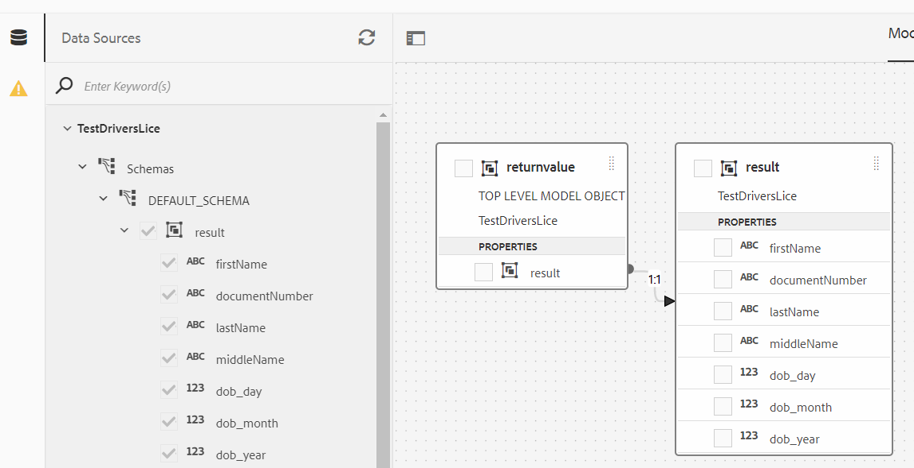

# OCR Data Extraction

Automatically extract data from a wide variety of government issued documents to populate your adaptive forms.

There are a number of organizations providing this service and as long as they have well documented REST API's you can easily integrate with AEM Forms using the data integration capability. For the purpose of this tutorial, I have used [ID Analyzer](https://www.idanalyzer.com/) to demonstrate the OCR data extraction of uploaded documents.

The following steps were followed to implement the OCR data extraction with AEM Forms using ID Analyzer service.

## Create developer account

Create a developer account with [ID Analyzer](https://portal.idanalyzer.com/signin.html). Make a note of the API Key. This key is needed to invoke REST API's of the ID Analyzer's service.

## Create Swagger/OpenAPI file

OpenAPI Specification (formerly Swagger Specification) is an API description format for REST APIs. An OpenAPI file allows you to describe your entire API, including:

* Available endpoints (/users) and operations on each endpoint (GET /users, POST /users)
* Operation parameters Input and output for each operation
Authentication methods
* Contact information, license, terms of use and other information.
* API specifications can be written in YAML or JSON. The format is easy to learn and readable to both humans and machines.

To create your first swagger/OpenAPI file, please follow the [OpenAPI documentation](https://swagger.io/docs/specification/2-0/basic-structure/)

>[!NOTE] 
> AEM Forms supports OpenAPI Specification version 2.0 (fka Swagger).

Use the [swagger editor](https://editor.swagger.io/) to create your swagger file to describe the operations that send and verify OTP code sent using SMS. The swagger file can be created in JSON or YAML format. The completed swagger file can be downloaded from [here](assets/drivers-license-swagger.zip)

## Considerations when defining the swagger file

* Definitions are required
* $ref need to be used for method definitions
* Prefer to have consumes and produces sections defined
* Do not define inline request body parameters or response parameters. Try to modularize as much as possible. For example the following definition is not supported

``` json
 "name": "body",
            "in": "body",
            "required": false,
            "schema": {
              "type": "object",
              "properties": {
                "Rollnum": {
                  "type": "string",
                  "description": "Rollnum"
                }
              }
            }
```

The following is supported with a reference to requestBody definition

```json
 "name": "requestBody",
            "in": "body",
            "required": false,
            "schema": {
              "$ref": "#/definitions/requestBody"
            }

```

* [Sample Swagger file for your reference](assets/sample-swagger.json)

## Create Data Source

To integrate AEM/AEM Forms with third party applications, we need to [create data source](https://experienceleague.adobe.com/docs/experience-manager-learn/forms/ic-web-channel-tutorial/parttwo.html) in the cloud services configuration. Please use the [swagger file](assets/drivers-license-swagger.zip) to create your data source.

## Create Form Data Model

AEM Forms data integration provides an intuitive user interface to create and work with [form data models](https://experienceleague.adobe.com/docs/experience-manager-65/forms/form-data-model/create-form-data-models.html). Base the form data model on the data source created in the earlier step.



## Create Client Lib

We would need to get base64 encoded string of the uploaded document. This base64 encoded string is then passed as one of the parameters of our REST invocation.
The client library can be downloaded [from here.](assets/drivers-license-client-lib.zip)

## Create Adaptive Form 

Integrate the POST invocations of the Form Data Model with your adaptive form to extract data from the uploaded document by the user in the form. You are free to create your own adaptive form and use the form data model's POST invocation to send the base64 encoded string of the uploaded document. 

## Deploy on your server

If you want to use the sample assets with your API key please follow the following steps:

* [Download the data source](assets/drivers-license-source.zip) and import into AEM using [package manager](http://localhost:4502/crx/packmgr/index.jsp)
* [Download the form data model](assets/drivers-license-fdm.zip) and import into AEM using [package manager](http://localhost:4502/crx/packmgr/index.jsp)
* [Download the client lib](assets/drivers-license-client-lib.zip)
* Download the sample adaptive form can be [downloaded from here](assets/adaptive-form-dl.zip). This sample form uses the service invocations of the form data model that is provided as part of this article.
* Import the form into AEM from the [Forms and Document UI](http://localhost:4502/aem/forms.html/content/dam/formsanddocuments)
* Open the form in [edit mode.](http://localhost:4502/editor.html/content/forms/af/driverslicenseandpassport.html)
* Specify your API Key as the default value in the apikey field and save your changes
* Open the rule editor for the Base 64 String field. Notice the service invocation when the value of this field is changed.
* Save the form
* [Preview the form](http://localhost:4502/content/dam/formsanddocuments/driverslicenseandpassport/jcr:content?wcmmode=disabled), upload front picture of your drivers license
