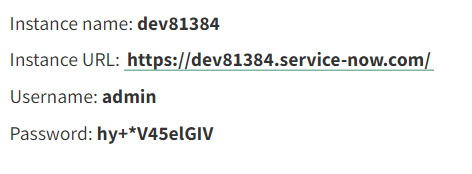

# Integrate AEM Forms with [!DNL ServiceNow]

Create and display incident in [!DNL ServiceNow] using Form Data Model in AEM Forms.

## Prerequisites

* [!DNL ServiceNow] account.
* Familiar with [creating data sources](https://experienceleague.adobe.com/docs/experience-manager-learn/forms/ic-web-channel-tutorial/parttwo.html)
* Familiar with [Form Data Model](https://experienceleague.adobe.com/docs/experience-manager-65/forms/form-data-model/create-form-data-models.html)

## Sample Assets

The sample assets provided with this article include the following

* Cloud service configuration
* Swagger files to create an incident and fetch all   incidents
* Form Data Model based on the swagger files
* Adaptive Form to create and list [!DNL ServiceNow] incidents

## Deploy the assets on your server

* Download the [sample assets](assets/service-now.zip)
* Import the assets into AEM using [package manager](http://localhost:4502/crx/packmgr/index.jsp)
* The swagger file used for this integration is located under the ```/conf/9957/settings/cloudconfigs/fdm``` folder in crx repository
* Edit the [CreateIncident cloud service configuration](http://localhost:4502/mnt/overlay/fd/fdm/gui/components/admin/fdmcloudservice/properties.html?item=%2Fconf%2F9957%2Fsettings%2Fcloudconfigs%2Ffdm%2Fcreateincident)to match your ServiceNow instance.
* Edit the [GetAllIncidents cloud service configuration](http://localhost:4502/mnt/overlay/fd/fdm/gui/components/admin/fdmcloudservice/properties.html?item=%2Fconf%2F9957%2Fsettings%2Fcloudconfigs%2Ffdm%2Fgetallincidents) to match your ServiceNow instance. You will need to change the host,username and password to match your ServiceNow instance credentials.

## Access ServiceNow instance credentials

* Click on your user profile
 
 
* Click on Manage instance Password
* The instance details is shown as below


## Test the integration

* [Open the Adaptive Form](http://localhost:4502/content/dam/formsanddocuments/create-incident-in-service-now/jcr:content?wcmmode=disabled)
* Enter some values in the description and comments field and click Create Incident button
* The incident Id of the newly create incident should get populated in the text field and the table below should list all the incidents.
