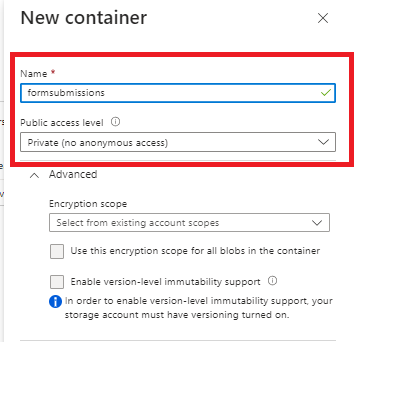
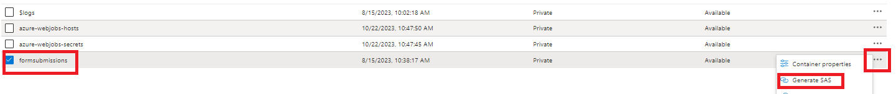
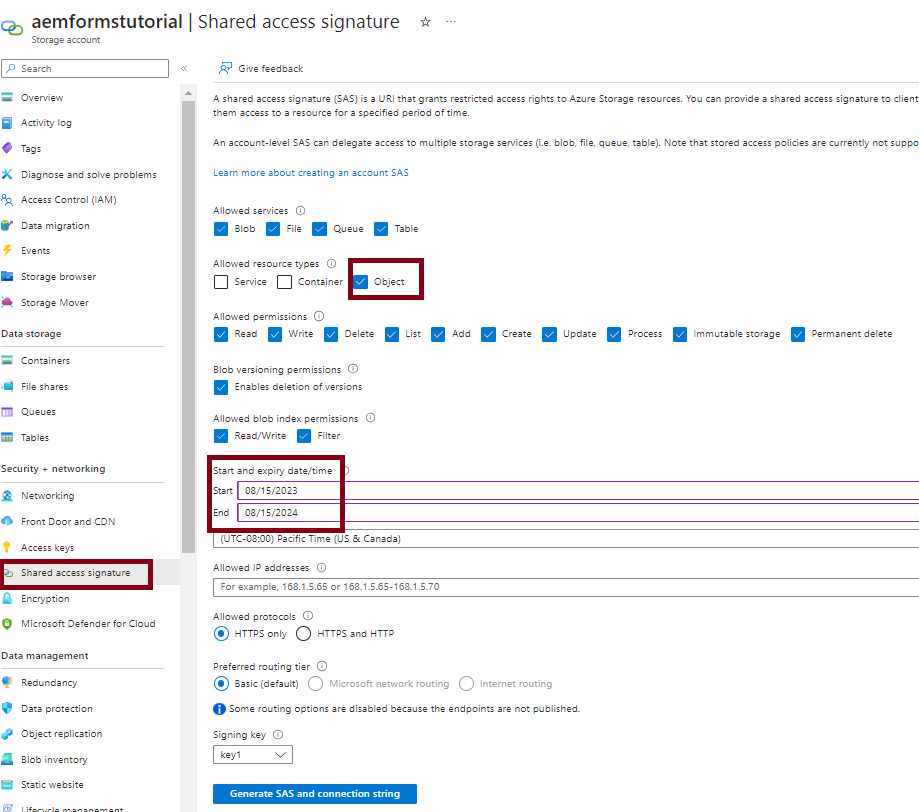
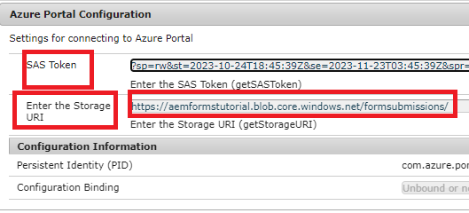
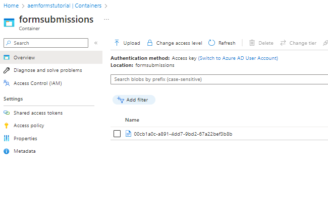

# Store form submissions in Azure Storage

This article shows you how to make REST calls to store submitted AEM Forms data in Azure Storage.
To be able to store submitted form data in Azure Storage, the following steps must be followed.

## Create Azure Storage account

[Login to your Azure portal account and create a storage account](https://learn.microsoft.com/en-us/azure/storage/common/storage-account-create?tabs=azure-portal#create-a-storage-account-1). Provide a meaningful name to your storage account, click Review and then click Create. This creates your storage account with all the default values. For the purpose of this article we have named our storage account `aemformstutorial`.


## Create container

The next thing we need to do is to create a container to store the data from form submissions.
From the storage account page, click on the Containers menu item on the left and create a container called `formssubmissions`. Make sure the public access level is set to private


## Create SAS on the container

We'll be making us of the Shared Access Signature or SAS Method of authorization to interact with the Azure Storage container.
Navigate to the container in the storage account, click on the ellipsis and select the Generate SAS option as shown in the screenshot

 Make sure you specify appropriate permissions and the appropriate End date as shown in the screenshot below and click on Generate SAS token and URL. Copy the Blob SAS token and Blob SAS url. We will be using these two values to make our HTTP calls
 


## Provide the Blob SAS token and Storage URI

 To make the code more generic, the two properties can be configured using the OSGi configuration as shown below. The _**aemformstutorial**_ is the name of the storage account, _**formsubmissions**_ is the container in which the data will be stored.
 


## Create PUT request

The next step is to create a PUT request to store the submitted form data in Azure Storage. Every form submission needs to be identified by a unique BLOB ID. The unique BLOB ID is typically created in your code and inserted in the url of the PUT request.
The following is the partial URL of the PUT request. The `aemformstutorial` is the name of the storage account, formsubmissions is the container in which the data will be stored with unique BLOB ID. The rest of the url will be remain the same. 
https://aemformstutorial.blob.core.windows.net/formsubmissions/blobid/sastoken
The following is function written to store the submitted form data in Azure Storage using a PUT request. Notice the use of container name and the uuid in the url. You can create an OSGi service or a sling servlet using the sample code listed below and store the form submissions in Azure Storage.

``` java
 public String saveFormDatainAzure(String formData) {
    log.debug("in SaveFormData!!!!!" + formData);
    String sasToken = azurePortalConfigurationService.getSASToken();
    String storageURI = azurePortalConfigurationService.getStorageURI();
    log.debug("The SAS Token is " + sasToken);
    log.debug("The Storage URL is " + storageURI);
    org.apache.http.impl.client.CloseableHttpClient httpClient = HttpClientBuilder.create().build();
    UUID uuid = UUID.randomUUID();
    String putRequestURL = storageURI + uuid.toString();
    putRequestURL = putRequestURL + sasToken;
    HttpPut httpPut = new HttpPut(putRequestURL);
    httpPut.addHeader("x-ms-blob-type", "BlockBlob");
    httpPut.addHeader("Content-Type", "text/plain");

    try {
        httpPut.setEntity(new StringEntity(formData));

        CloseableHttpResponse response = httpClient.execute(httpPut);
        log.debug("Response code " + response.getStatusLine().getStatusCode());
        if (response.getStatusLine().getStatusCode() == 201) {
            return uuid.toString();
        }
    } catch (IOException e) {
        log.error("Error: " + e.getMessage());
        throw new RuntimeException(e);
    }
    return null;

}

```

## Verify stored data in the container



## Test the solution

* [Deploy the custom OSGi bundle](./assets/SaveAndFetchFromAzure.core-1.0.0-SNAPSHOT.jar)

* [Import the custom adaptive form template and the page component associated with the template](./assets/store-and-fetch-from-azure.zip)

* [Import the sample adaptive form](./assets/bank-account-sample-form.zip)

* Specify the appropriate values in the Azure Portal Configuration using the OSGi configuration console
* [Preview and submit the BankAccount form](http://localhost:4502/content/dam/formsanddocuments/azureportalstorage/bankaccount/jcr:content?wcmmode=disabled)

* Verify the data is stored in the Azure storage container of your choice. Copy the Blob ID.
* [Preview the BankAccount form](http://localhost:4502/content/dam/formsanddocuments/azureportalstorage/bankaccount/jcr:content?wcmmode=disabled&guid=dba8ac0b-8be6-41f2-9929-54f627a649f6) and specify the Blob ID as a guid parameter in the URL for the form to be prepopulated with the data from Azure storage

