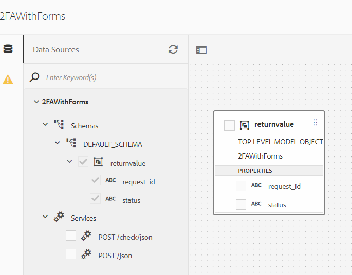
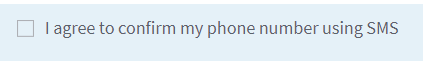

# Verify users using their mobile phone numbers

SMS Two Factor Authentication (Dual Factor Authentication) is a security verification procedure, which is triggered through a user logging into a website, software or application. In the log-in process, the user is automatically sent an SMS to their mobile number containing a unique numeric code.

There are a number of organizations providing this service and as long as they have well documented REST API's you can easily integrate AEM Forms using the data integration capabilities of AEM Forms. For the purpose of this tutorial, I have used [Nexmo](https://developer.nexmo.com/verify/overview) to demonstrate the SMS 2FA use case.

The following steps were followed to implement the SMS 2FA with AEM Forms using Nexmo Verify service.

## Create developer account

Create a developer account with [Nexmo](https://dashboard.nexmo.com/sign-in). Make a note of the API Key and API Secret Key. These keys are needed to invoke REST API's of the Nexmo's service.

## Create Swagger/OpenAPI file

OpenAPI Specification (formerly Swagger Specification) is an API description format for REST APIs. An OpenAPI file allows you to describe your entire API, including:

* Available endpoints (/users) and operations on each endpoint (GET /users, POST /users)
* Operation parameters Input and output for each operation
Authentication methods
* Contact information, license, terms of use and other information.
* API specifications can be written in YAML or JSON. The format is easy to learn and readable to both humans and machines. 

To create your first swagger/OpenAPI file, please follow the [OpenAPI documentation](https://swagger.io/docs/specification/2-0/basic-structure/)

>[!NOTE] 
> AEM Forms supports OpenAPI Specification version 2.0 (fka Swagger).

Use the [swagger editor](https://editor.swagger.io/) to create your swagger file to describe the operations that send and verify OTP code sent using SMS. The swagger file can be created in JSON or YAML format. The completed swagger file can be downloaded from [here](assets/two-factore-authentication-swagger.zip)

## Create Data Source

To integrate AEM/AEM Forms with third party applications, we need to [create data source](https://experienceleague.adobe.com/docs/experience-manager-learn/forms/ic-web-channel-tutorial/parttwo.html) in the cloud services configuration.

## Create Form Data Model

AEM Forms data integration provides an intuitive user interface to create and work with [form data models](https://experienceleague.adobe.com/docs/experience-manager-65/forms/form-data-model/create-form-data-models.html). A form data model relies on data sources for exchange of data.
The completed form data model can be [downloaded from here](assets/sms-2fa-fdm.zip)

## Create Adaptive Form 

Integrate the POST invocations of the Form Data Model with your adaptive form to verify the mobile phone number entered by the user in the form. You are free to create your own adaptive form and use the form data model's POST invocation to send and verify OTP code as per your requirements. 

If you want to use the sample assets with your API keys please follow the following steps:

* [Download the form data model](assets/sms-2fa-fdm.zip) and import into AEM using [package manager](http://localhost:4502/crx/packmgr/index.jsp)
* Download the sample adaptive form can be [downloaded from here](assets/sms-2fa-verification-af.zip). This sample form uses the service invocations of the form data model that is provided as part of this article.
* Import the form into AEM from the [Forms and Document UI](http://localhost:4502/aem/forms.html/content/dam/formsanddocuments)
* Open the form in edit mode. Open the rule editor for the following field

* Edit the rule associated with the field. Provide your appropriate API keys
* Save the form
* [Preview the form](http://localhost:4502/content/dam/formsanddocuments/sms-2fa-verification/jcr:content?wcmmode=disabled) and test the functionality
