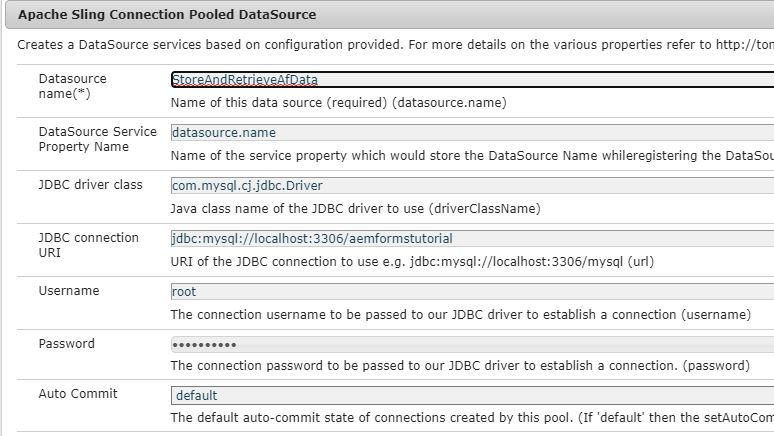
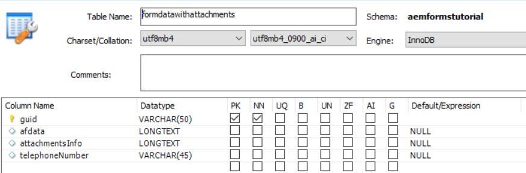
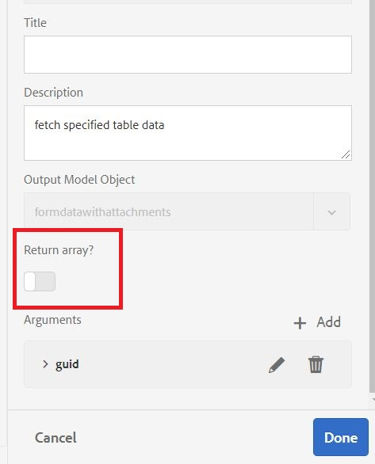

# Configure Data Source

There are many ways in which AEM enables integration with an external database. One of the most common & standard practices of database integration is by using Apache Sling Connection Pooled DataSource configuration properties through the [configMgr](http://localhost:4502/system/console/configMgr).
The first step is to download and deploy the appropriate [MySQL drivers](https://mvnrepository.com/artifact/mysql/mysql-connector-java) to AEM.
Then, set the Sling Connection Pooled DataSource properties specific to your database. The following screenshot shows the settings used for this tutorial. The database schema is provided to you as part of this tutorial assets.

>[!NOTE]
>Please make sure you name your datasource `StoreAndRetrieveAfData` as this is the name used in the OSGi service.

| Property Name       | Property Value                                                                     |   |
|---------------------|------------------------------------------------------------------------------------|---|
| Datasource name     | `StoreAndRetrieveAfData`                                                             |   |
| JDBC drive class    | `jdbc:mysql://localhost:3306/aemformstutorial`                                       |   |
| JDBC connection URI | `jdbc:mysql://localhost:3306/aemformstutorial?serverTimezone=UTC&autoReconnect=true` |   |
|                     |                                                                                    |   |

## Create database

The following database was used for the purpose of this use case. The database has one table called `formdatawithattachments` with the 4 columns as shown in the screenshot below.
 

* The column **afdata** will hold the adaptive form data.
* The column **attachmentsInfo** will hold the information about the form attachments.
* The columns **telephoneNumber** will hold the mobile number of the person filling out the form.

Please create the database by importing the [database schema](assets/data-base-schema.sql)
using MySQL workbench.

## Create Form Data Model

Create the form data model and base it on the datasource created in the previous step.
Configure the **get** service of this form data model as shown in the screenshot below.
Make sure you are not returning an array in the **get** service.

The purpose of this **get** service is to fetch the telephone number associated with the application id.

This form data model will then be used in the **MyAccountForm** to fetch the telephone number associated with the application id.

## Next Steps

[Write code to save form attachments](./store-form-attachments.md)
