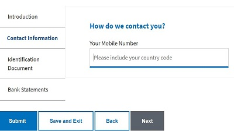

# Create the main adaptive form

The form **StoreAFWithAttachments** is the main adaptive form. This adaptive form is the entry point to the use case. In this form user details including mobile number are captured. This form also has the ability to add some attachments. When the Save and Exit button is clicked the server side code is executed to store the form data in the database and a unique application id is generated and presented to the user for safe keeping. This application id is used to retrieve the mobile number associated with the application.

This form is associated with **bootboxjs540,storeAFWithAttachments** client libraries created earlier in the course and an AEM workflow which gets triggered on form submission.

* The sample forms are based on [custom adaptive form template](assets/custom-template-with-page-component.zip) that needs to be imported into AEM for the sample forms to render correctly.

* The completed [StoreAfWithAttachments Form](assets/store-af-with-attachments-form.zip) can be downloaded and imported into your AEM instance.

* The [AEM workflow associated with this form](assets/workflow-model-store-af-with-attachments.zip) need to be imported into your AEM instance for the form to work.

## Next steps

[Create the form retrieving saved form](./retrieve-saved-form.md)