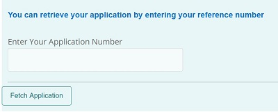
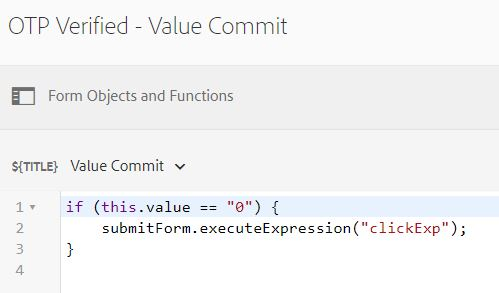

# Create the MyAccountForm

The form **MyAccountForm** is used to retrieve the partially completed adaptive form after the user has verified the application id and the mobile number associated with the application id.



When the user enters the application id and clicks the **FetchApplication** button, the mobile number associated with the application id is fetched from the database using the Get operation of the form data model.

This form makes use of the POST invocation of the Form Data Model to verify the mobile number using OTP. The form's submit action is triggered on successful verification of the mobile number using the following code. We are triggering the click event of the submit button named **submitForm**.

>[!NOTE]
> You will need to provide the API Key and the API Secret values specific to your [Nexmo](https://dashboard.nexmo.com/) account in the appropriate fields of the MyAccountForm




This form is associated with custom submit action that forwards the form submission to the servlet mounted on **/bin/renderaf**

``` java
com.adobe.aemds.guide.utils.GuideSubmitUtils.setForwardPath(slingRequest,"/bin/renderaf",null,null);

```

The code in the servlet mounted on **/bin/renderaf** forwards the request to render the storeafwithattachments adaptive form prepopulated with the saved data.


* The MyAccountForm can be [downloaded from here](assets/my-account-form.zip)

* Sample forms are based on [custom adaptive form template](assets/custom-template-with-page-component.zip) that needs to be imported into AEM for the sample forms to render correctly.

* [Custom submit handler](assets/custom-submit-my-account-form.zip) associated with the MyAccountForm submission needs to be imported into AEM.
