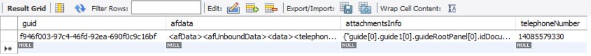

# Store form data

Next step is to create a service to insert a new row in the database to store the adaptive form data and the associated attachmentsinfo.
The following screen shot shows a row in the database.





The following code inserts a new row in the database with the appropriate data

```java
public String storeFormData(String formData, String attachmentsInfo, String telephoneNumber) {
    log.debug("******Inside my AEMFormsWith DB service*****");
    log.debug("### Inserting data ... " + formData + "and the telephone number to insert is  " + telephoneNumber);
    String insertRowSQL = "INSERT INTO aemformstutorial.formdatawithattachments(guid,afdata,attachmentsInfo,telephoneNumber) VALUES(?,?,?,?)";
    UUID uuid = UUID.randomUUID();
    String randomUUIDString = uuid.toString();
    log.debug("The insert query is " + insertRowSQL);
    Connection c = getConnection();
    PreparedStatement pstmt = null;
    try {
        pstmt = null;
        pstmt = c.prepareStatement(insertRowSQL);
        pstmt.setString(1, randomUUIDString);
        pstmt.setString(2, formData);
        pstmt.setString(3, attachmentsInfo);
        pstmt.setString(4, telephoneNumber);
        log.debug("Executing the insert statment  " + pstmt.executeUpdate());
        c.commit();
    } catch (SQLException e) {

        log.error("unable to insert data in the table", e.getMessage());
    } finally {
        if (pstmt != null) {
            try {
                pstmt.close();
            } catch (SQLException e) {
                log.debug("error in closing prepared statement " + e.getMessage());
            }
        }
        if (c != null) {
            try {
                c.close();
            } catch (SQLException e) {
                log.debug("error in closing connection " + e.getMessage());
            }
        }
    }
    return randomUUIDString;
}
```

## Next Steps

[Implement Save and Exit](./create-servlet.md)

