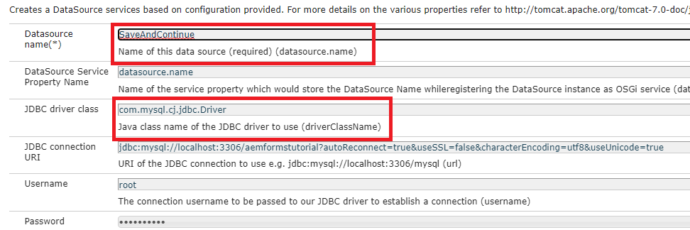
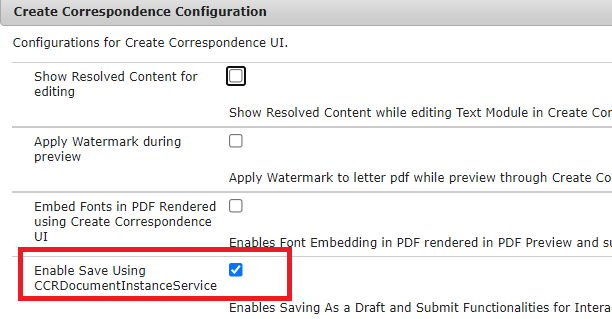

# Deploy the sample assets on your server

Please follow the below instructions to get this functionality working on your AEM Server

* Create a folder called icdrafts in your c drive
* [Create the database schema](assets/icdrafts.sql)
* [Import the client library](assets/icdrafts.zip)
* [Import the Adaptive Form](assets/SavedDraftsAdaptiveForm.zip)
* Create data source called _SaveAndContinue_

* [Deploy the icdrafts bundle](assets/icdrafts.icdrafts.core-1.0-SNAPSHOT.jar)
* Make sure you _Enable Save Using CCRDocumentInstanceService_ in OSGI config as shown below

* Open any Interactive Communication. Click the Save as Draft to save
* [View Saved Drafts](http://localhost:4502/content/dam/formsanddocuments/saveddrafts/jcr:content?wcmmode=disabled)

>[!NOTE]
>The xml files are stored in the root folder of your AEM server installation. The eclipse project >is provided to you to customize the solution as per your requirements.

The eclipse project with sample implementation can be [downloaded from here](assets/icdrafts-eclipse-project.zip)
