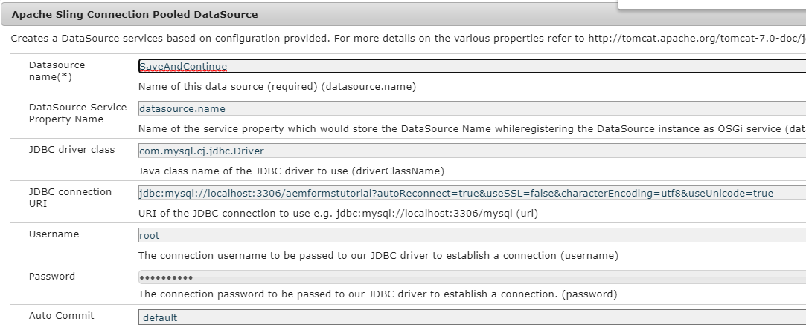
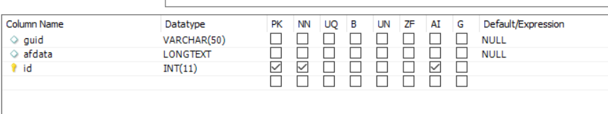

# Configure Data Source

There are many ways with which AEM enables integration with external database. One of the most common & standard practice of database integration is by using Apache Sling Connection Pooled DataSource configuration properties through the [configMgr](http://localhost:4502/system/console/configMgr).
The first step is to download and deploy the appropriate [MySql drivers](https://mvnrepository.com/artifact/mysql/mysql-connector-java) in AEM.
Create Apache Sling Connection Pooled DataSource and provide the properties as specified in the screen shot below. The database schema is provided to you as part of this tutorial assets.

Database has one table called formdata with the 3 columns as shown in the screen-shot below.

 

The sql file to create the schema can be [downloaded from here](assets/form-data-db.sql). You will need to import this file using MySql workbench to create the schema and the table.

>[!NOTE]
>Please make sure you name your datasource **SaveAndContinue**. The sample code uses the name to connect to the database.

| Property Name| Value |
| ------------------------|---------------------------------------|
| Datasource Name| SaveAndContinue |
| JDBC Driver Class| com.mysql.cj.jdbc.Driver |
| JDBC connection uri| jdbc:mysql://localhost:3306/aemformstutorial |
