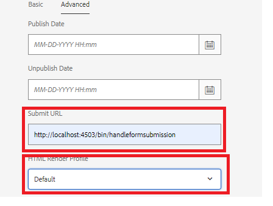

# Getting this use case to work on your system

>[!NOTE]
>
>For the sample assets to work on your system, it is assumed you have access to an AEM Forms author and and AEM Forms publish instance.

To get this use case working on your local system, following these steps:

## Deploy the following on your AEM Forms author instance

* [Install the MobileFormToWorkflow bundle](assets/MobileFormToWorkflow.core-1.0.0-SNAPSHOT.jar)

* [Deploy the Developing with Service User bundle](https://experienceleague.adobe.com/docs/experience-manager-learn/assets/developingwithserviceuser.zip?lang=en)
Add the following entry in the Apache Sling Service User Mapper Service using the configMgr

```
DevelopingWithServiceUser.core:getformsresourceresolver=fd-service
```

* You can store the form submissions in a different folder by specifying the folder name in the AEM Server Credentials configuration using the [configMgr](http://localhost:4502/system/console/configMg). If you change the folder, make sure you create a launcher on the folder to trigger the workfow **ReviewSubmittedPDF**


* [Import the sample xdp and the workflow package using package manager](assets/xdp-form-and-workflow.zip).


## Deploy the following assets on publish instance

* [Install the MobileFormToWorkflow bundle](assets/MobileFormToWorkflow.core-1.0.0-SNAPSHOT.jar)

* Specify the username/password for the author instance and an **existing location in your AEM repository** to store the submitted data in the AEM Server credentials using the [configMgr](http://localhost:4503/system/console/configMgr). You can leave the URL of the endpoint on AEM Workflow Server as is. This is the endpoint which extracts and stores the data from the submission in the specified the node.


* [Deploy the Developing with Service User bundle](https://experienceleague.adobe.com/docs/experience-manager-learn/assets/developingwithserviceuser.zip?lang=en)
* [Open the osgi configuration ](http://localhost:4503/system/console/configMgr).
* Search for  **Apache Sling Referrer Filter**. Make sure the Allow Empty checkbox is selected.


## Test the solution

* Login to your author instance
* [Edit the advanced properties of the w9.xdp](http://localhost:4502/libs/fd/fm/gui/content/forms/formmetadataeditor.html/content/dam/formsanddocuments/w9.xdp). Make sure the submit url and render profile are set correctly as shown below.


* Publish the w9.xdp
* Login to publish instance
* [Preview the w9 form](http://localhost:4503/content/dam/formsanddocuments/w9.xdp/jcr:content)
* Fill in some form fields and submit the form
* Login to AEM Author instance as admin
* [Check the AEM Inbox](http://localhost:4502/aem/inbox)
* You should have workitem to review the submitted PDF

>[!NOTE]
>
>Instead of submitting the PDF to servlet running on publish instance, some customers have deployed the servlet in servlet container such as Tomcat. It all depends on the topology the customer is comfortable with.For the purpose of this tutorial we are going to use the servlet deployed on publish instance for handling the form submissions.
