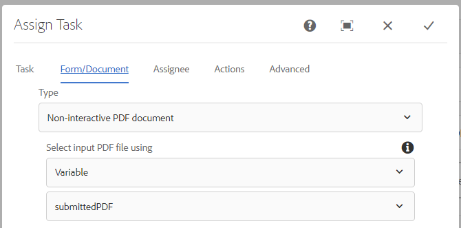

# Workflow to review and approve the submitted PDF

The last and final step is to create AEM workflow which will generate a static, or non-interactive PDF for review and approval. Workflow is triggered via an AEM Launcher configured on the node `/content/formsubmissions`.

The following screenshot shows the steps involved in the workflow.


## Generate Non-Interactive PDF workflow step

The XDP template and the data to be merged with the template is specified here. The data to be merged is the submitted data from the PDF. This submitted data is stored under the node ```/content/formsubmissions```


The generated PDF is assigned to workflow variable called `submittedPDF`.


### Assign the generated pdf for review and approval

Assign task workflow component is used here to assign the generated PDF for review and approval. The variable `submittedPDF` is used in the Forms and Documents tab of the Assign Task workflow component.




## Next Steps

[Deploy the assets in your environment](./deploy-assets.md)