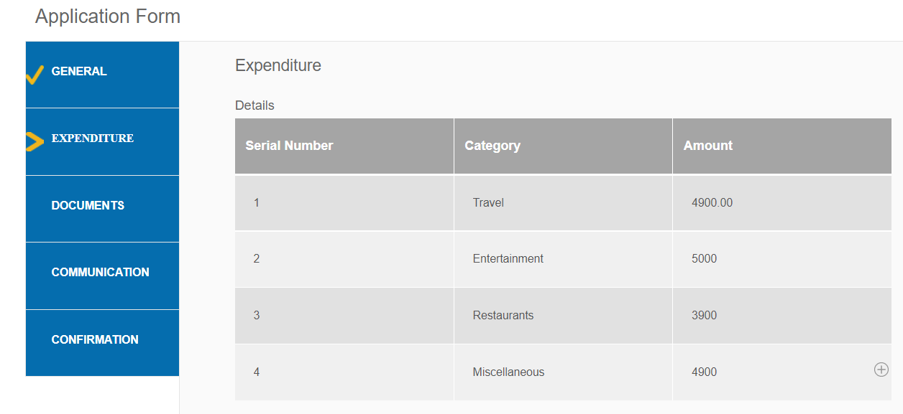
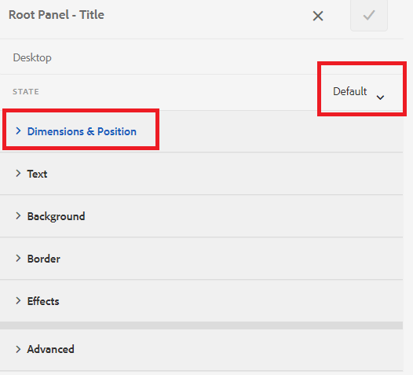
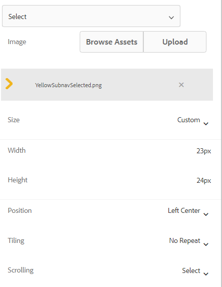

# Add icons to indicate active and completed tabs

When you have adaptive form with left tab navigation, you may want to display icons to indicate the status of the tab. For example, you want to show an icon to indicate active tab and icon to indicate completed tab as shown in the screenshot below.

## Create an Adaptive Form

A simple Adaptive Form based on the Basic template and Canvas 3.0 theme was used to create the sample form.
The [icons used in this article](assets/icons.zip) can be downloaded from here.

## Style the Default State

Open the form in edit mode
Make sure you are in the style layer and select any tab(For example General tab).
You are in the default state when you open the style editor for the tab as shown in the screen shot below

Set the CSS properties for the default state as shown below
| Category | Property Name  |  Property Value |
|:---|:---|:---|
| Dimensions and Position | Width | 50px |
| Text | Font Weight| Bold |
| Text | Color | #FFF |
|Text | Line Height| 3 |
|Text  | Text Align | Left | 
|Background| Color | #056dae |

Save your changes

## Style the Active State

Make sure you are in the Active state and style the following CSS properties

|  Category | Property Name  |  Property Value |
|:---|:---|:---|
| Dimensions and Position | Width | 50px |
| Text | Font Weight| Bold |
| Text | Color | #FFF |
|Text | Line Height| 3 |
|Text  | Text Align | Left | 
|Background| Color | #056dae |

Style the background image as shown in the screen shot below

Save your changes.

## Style the Visited State

Make sure you are in the visited state and style the following properties

|  Category | Property Name  |  Property Value |
|:---|:---|:---|
| Dimensions and Position | Width | 50px |
| Text | Font Weight| Bold |
| Text | Color | #FFF |
|Text | Line Height| 3 |
|Text  | Text Align | Left | 
|Background| Color | #056dae |

Style the background image as shown in the screen shot below

Save your changes

Preview the form and test the icons are working as expected.
